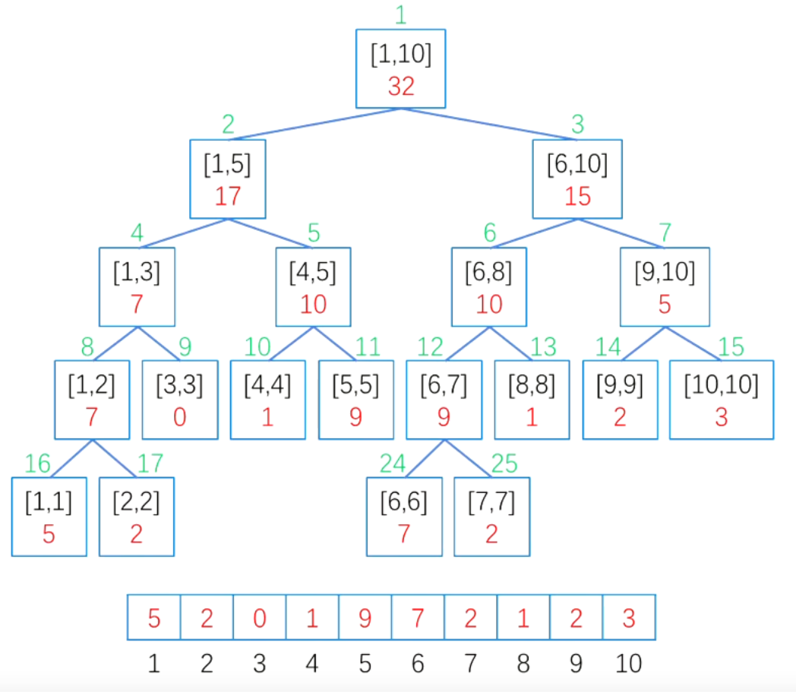

# Templates for Algo&DS

## 二叉树

### 二叉树非递归遍历

#### 先序

```c++
//沿着左子树往下访问，同时将访问节点的右孩子入栈
void vistAlongLeftBranch(node* root,stack<node*> &st){
	while(root){
		visit(root);//先序在此处访问节点
		st.push(root->rchild);
		root=root->lchild;
	}
}
void preOrder(node* root){
	stack<node*> st;
	node *p=root;
	while(1){
		visitAlongLeftBranch(p,st);
		if(st.empty())
			break;
		p=st.top();
		st.pop();
	}
}
```

#### 中序

```c++
//将左分支依次入栈，出栈时访问节点并将其右子树按同样方式入栈
void goAlongLeftBranch(node* root,stack<node*> &st){
	while(root){//中序不在该函数内visit，而是在出栈时visit
		st.push(root);
		root=root->lchild;
	}
}
void inOrder(node* root){
	stack<node*> st;
	node* p=root;
	while(1){
		goAlongLeftBranch(p,st);
		if(st.empty())
			break;
		p=st.top();
		st.pop();
		visit(p);//中序在此处访问节点，只是将先序中vistAlongLeftBranch中的两句移到了这里
		p=p->rchild;
	}
}
```

#### 后序

```C++
//后序的逆序与先序对称
//按中右左入栈，出栈时即是左右中
//将中右左形式的先序遍历的visit改成入ans栈，最后统一访问即可
void goAlongRightBranch(node* root,stack<node*> &st,stack<node*> &ans){
	while(root){//注意对照先序
		ans.push(root);//等同于先序中的visit()
		st.push(root->lchild);//st存放右分支链的左孩子
		root=root->rchild;
	}
}
void postOrder(node* root){
	stack<node*> st,ans;
	node* p=root;
	while(1){
		goAlongRightBranch(p,st,ans);
		if(st.empty())
			break;
		p=st.top();
		st.pop();
	}
	while(!ans.empty()){//依次访问ans栈中所有节点
		visit(ans.top());
		ans.pop();
	}
}
```

#### 层次

```c++
//层次遍历
void levelOrder(node *root){
	queue<int> q;
	q.push(root);
	node* temp=NULL;
	while(!q.empty()){
		temp=q.front();
		q.pop();
		vist(temp);
		if(temp->lchild)
			q.push(temp->lchild);
		if(temp->rchild)
			q.push(temp->rchild);
	}
}
```

### 二叉树的构造

中序可以和先序、后续、层次任意一个确定一棵二叉树

```C++
//通过中序遍历和先序序列构造一棵二叉树
node* create(int pre[],int in[],int preL,int preR,int inL,int inR){
	if(preL>preR)//先序序列长度小于0，直接返回
		return NULL;
	node* root=new node;
	root->data=pre[preL];
	int k;
	for(k=inL;k<=inR;k++){
		if(in[k]==pre[preL])
			break;
	}
	int numLeft=k-inL;
	root->lchild=create(pre,in,preL+1,preL+numLeft,inL,k-1);
	root->rchild=create(pre,in,preL+numLeft+1,preR,k+1,inR);
	return root;
}
```

### 二叉树的高度

```c++
int Depth(node *root){
	if(!root)
		return 0;
	return 1+max(Depth(root->lchild),Depth(root->rchild));
}
```

### 二叉树宽度递归 

```c++
int cnt[MaxSize];//hash，cnt[i]为i层节点数
void getBiWid(node *root,int k,int &MaxWith){ //k变量为当前层数 默认从第一层开始
	if(!root)
		return;
	cnt[k]++;
	MaxWidth=max(MaxWidth,cnt[k]);//更新最大宽度
	getBiWid(root->lchild,k+1);
	getBiWid(root->rchild,k+1);
}
int width(node *root){
	int MaxWidth=0;
	getBiWid(root,1,MaxWidth);
	return MaxWidth;
}
```

## 二叉查找树BST

```c++
struct node{
	int data;
	node* lchild=NULL;
	node* rchild=NULL;
	node(int x):data(x){}
};
```

### BST插入

O(logn)

```C++
void insert(node* &root,int x){//需要改变root本身，所以要用引用
	if(root==NULL){
		root=new node(x);//这就是root设为引用的原因
		return;
	}
	if(x==root->data)//说明节点已存在，不用插入
		return；
	else if(x<root->data)
		insert(root->lchild,x);
	else
		insert(root->rchild,x);
}
```

### BST建立

O(nlogn)

```C++
node* create(int data[],int n){
	node* root=NULL;
	for(int i=0;i<n;i++)
		insert(root,data[i]);
	return root;
}
```

### BST查找

#### 递归

O(logn)

```C++
node* search(node* root,int x){
	if(!root)
		return NULL;
	if(x==root->data)
		return root;
	else if(x<root->data)
		return search(root->lchild,x);
	else
		return search(root->rchild,x);
}
```

#### 非递归

O(logn)

```c++
node* search(node* root,int x){
	while(root&&x!=root->data){
		if(x<root->data)
			root=root->lchild;
		else
			root=root->rchild;
	}
	return root;
}
```

#### 寻找权值最大的节点

```C++
node* findMax(node* root){//最右节点权值最大
	while(root->rchild)//注意这里一定是判断孩子为空作为停止条件，因为最终是要将root返回的
		root=root->rchild;
	return root;
}
```

#### 寻找权值最小节点

```C++
node* findMin(node* root){//最左节点权值最小
	while(root->lchild)
		root=root->lchild;
	return root;
}
```

### BST删除节点

```c++
//删除data为x的节点
void deleteNode(node* &root,int x){//注意是引用，因为会直接修改root
	if(root==NULL)
		return;
	if(root->data==x){//删除节点分三种情况，叶子，有左孩，有右孩
		if(!root->lchild&&!root->rchild){//叶子结点直接删除
			delete root;
			root=NULL;//防止野指针
		}else if(root->lchild){//若欲删除节点有左子树，那么用其前驱覆盖它，然后递归删除其前驱
			node* pre=findMax(root->lchild);//左子树中的最大节点是根节点的前驱
			root->data=pre->data;//用前驱覆盖root
			deleteNode(pre,pre->data);//BST的规则被破坏了，因此要递归删除节点pre
		}else{//若欲删除节点有右子树，那么用其后继覆盖它，然后递归删除其后继
			node *next=findMin(root->rchild);//右子树中的最小节点是根节点的后继
			root->data=next->data;//用后继覆盖root
			deleteNode(next,next->data);//BST的规则被破坏了，因此要递归删除next
		}
	}else if(x<root->data){
		deleteNode(root->lchild,x);
	}else{
		deleteNode(root->rchild,x);
	}
}
```

## 平衡二叉查找树AVL

```C++
struct node{
	int data,height;//v为权值，height为当前子树高度
	node* lchild=NULL;
	node* rchild=NULL;
	node(int x，int h):data(x),height(h){}
};
```

### AVL树高

```c++
//获取以root为根节点的子树的当前height
int getHeight(node* root){
	if(root==NULL)
		return 0;
	return root->height;
}
```

### 平衡因子

```c++
int getBalanceFactor(node* root){
	if(root==NULL)
		return 0;
	return getHeight(root->lchild)-getHeight(root->rchild);//左子树高度减右子树高度
}
```

### AVL失衡调整

原则：只要将最靠近插入节点的失衡节点调整到正常，路径上的所有节点就都会平衡

#### 更新节点height

```C++
void updateHeight(node* root){
	root->height=1+max(getHeight(root->lchild),getHeight(root->rchild));
}
```

#### 左旋

```C++
//左旋，root的右孩子换到root的位置，root变为其左孩子
void lRotate(node* &root){//会直接改变root，所以用引用
	node* temp=root->rchild;//temp是root的右孩子
	root->rchild=temp->lchild;//左旋时，temp的左孩子变成root的右孩子，其height最终并不变化
	temp->lchild=root;//temp的左孩子root变为
	updateHeight(root);//一定要先更新root的，因为此时root已在temp下层，height是根据子树高度计算的
	updateHeight(temp);
	root=temp;//temp替代root的位置,这是root加引用的原因
}
```

#### 右旋

```C++
void rRotate(node* &root){
	node* temp=root->lhild;
	root->lchild=temp->rchild;
	temp->rchild=root;
	updateHeight(root);
	updateHeight(temp);
	root=temp;
}
```

### 带平衡调整的AVL插入

```C++
//注意LR和RL的情况下，插入节点经过调整就不是叶子了，LL和RR插入节点调整后仍是叶子
void insert(node* &root,int x){
	if(root==NULL){
		root=new node(x,1);//节点高度初始为1
		return;
	}
	if(x==root->data){
		return;
	}else if(x<root->data){
		insert(root->lchild,x);//先插入，再调整
		updateHeight(root);//插完了更新树高，递归写法，因此是自下而上依次更新树高
		if(getBalanceFactor(root)==2){
			if(getBalanceFactor(root->lchild)==1){//在左子树的左子树上插入导致失衡，LL型，右旋
				rRotate(root);
			}else if(getBalanceFactor(root->lchild)==-1){//在左子树的右子树上插入导致失衡，LR型
				lRotate(root->lchild);//root的左子树先左旋，成为LL型
				rRotate(root);
			}
		}
	}else{
		insert(root->rchild,x);
		updateHeight(root);//递归写法，因此是自下而上依次更新树高
		if(getBalanceFactor(root)==-2){
			if(getBalanceFactor(root->rchild)==-1){//在右子树的右子树上插入导致失衡，RR型，左旋
				lRotate(root);
			}else if(getBalanceFactor(root->rchild)==1){//在右子树的左子树上插入导致失衡，RL型
				rRotate(root->rchild);//root的右子树先右旋，成为RR型
				lRotate(root);
			}
		}
	}
}
```

### AVL的建立

```C++
node* create(int data[],int n){
	node* root=NULL;
	for(int i=0;i<n;i++){
		insert(root,data[i]);
	}
	return root;
}
```

## 线段树

线段树是一种二叉树，每个叶子结点存储元素本身，非叶子节点存储区间内元素的统计值（区间和、区间最值、区间最大公约数等），可以在logn时间内执行区间修改和区间查询。



```c++
//root下标从1开始
#define lc root<<1
#define rc root<<1|1

class Node {
public:
    int l, r;//维护区间左右端点，为闭区间
    int sum;//叶子节点存储本身值，非叶子节点存储统计值，此处为区间和
    int add;//lazy标记，懒惰修改，只修改对查询有用的节点
    Node(int ls=0,int rs=0, int value=0, int lazy=0)
        :l(ls),r(rs),sum(value),add(lazy)
        {}
}tr[N<<2];//可以看作一个完全二叉树最多多一层，可以用四倍于数据量的数组存储

```

### 构造SegmentTree

```C++
//以维护区间和线段树为例

void pushUp(int root) {
//上传到根节点就是令节点的val等于左右节点val之和
	tr[root].sum=tr[lc].sum+tr[rc].sum;
}

//递归建树 O(logn)
void build(int root,int l,int r){
    tr[root]={l,r,w[l],0};
    if(l==r)//是叶子则返回
        return;
    int mid=l+r>>2;//不是叶子则从区间中点裂开；
    build(lc,l,m);
    build(rc,m+1,r);
    pushUp(root);//回溯，维护非叶节点
}
```

### 区间修改

```C++
//采用懒惰修改, O(logn)

void pushDown(int root) {
//如果Lazy没有被标记，就直接返回，否则要更新节点值，以及左右子节点的lazy值，并将当前节点的lazy值清空
    if (!tr[root].add) {
        return;
    }else{
        //维护统计量
    	tr[lc].sum+=(tr[lc].r-tr[lc].l+1)*tr[root].add;
        tr[rc].sum+=(tr[rc].r-tr[rc].l+1)*tr[root].add;
        
        //标记下放
        tr[lc].add+=tr[root].add;
        tr[rc].add+=tr[root].add;
        
        tr[root].add=0;
    }
}

void update(int root,int x, int y, int k){
    //覆盖维护区间，则修改
    if(tr[root].l>=x && tr[root].r<=y){
        tr[root].sum+=(tr[root].r-tr[root].l+1)*k;
        tr[root].add+=k;//懒惰修改，k为增加量
        return;
    }
    int mid=tr[p].l+tr[p].r>>1;//不覆盖则裂开
    pushDown(root);
    if(x<=mid)
        update(lc,x,y,k);
    if(y>mid)
        update(rc,x,y,k);
    pushUp(root);
}
```

### 区间查询

```C++
//O(logn)
int query(int root, int x, int y){
    if(tr[root].l>=x&&tr[root].r<=y)
        return tr[root].sum;//节点维护区间是查询区间的子区间则返回sum
    int mid=tr[root],l+tr[root].r>>1;//不覆盖则裂开
    pushDown(p);
    int sum=0;
    if(x<=mid)
        sum+=query(lc,x,y);
    if(y>mid)
     	sum+=query(rc,x,y);
    return sum;
}
```

### LeetCode

##### 732. 我的日程安排表Ⅲ

```c++
//线段树动态开点法模板

class MyCalendarThree {
public:
    int N=1e9;

    class Node{
    public:
        Node *left,*right;
        int l,r;
        int maxRepeat;
        int add;//lazy tag
        Node(int start,int end)
            :left(nullptr),
            right(nullptr),
            l(start),
            r(end),
            maxRepeat(0),
            add(0){}
    };

    Node *root=new Node(0,N);

    void pushUp(Node *p){
        p->maxRepeat=max(p->left->maxRepeat,p->right->maxRepeat);
    }

    void pushDown(Node *p){

        int mid = (p->l+p->r)>>1;
        if(p->left==nullptr) 
            p->left = new Node(p->l,mid);
        if(p->right==nullptr) 
            p->right = new Node(mid+1,p->r);
        if(p->add==0) 
            return;

        p->left->add += p->add;
        p->right->add += p->add;
        p->left->maxRepeat += p->add;
        p->right->maxRepeat += p->add;
        p->add = 0;
    }

    void update(Node *p, int l,int r){
        if(l<=p->l&&r>=p->r){
            p->maxRepeat+=1;
            p->add+=1;
            return;
        }
        pushDown(p);
        int mid=(p->l+p->r)>>1;
        if(mid>=l)
            update(p->left,l,r);
        if(mid<r)
            update(p->right,l,r);
        pushUp(p);
    }
  
    int book(int startTime, int endTime) {
        update(root,startTime,endTime-1);
        return root->maxRepeat;
    }
};

```

```C++
//差分数组法：一种辅助数组，记录原始数组相邻元素之间的差，即原数组中第i个位置值减去原数组第i-1个位置的值。假设我们频繁的对数组进行范围更新，则只需要更新端点即可。

class MyCalendarThree {
public:
    map<int,int> cnt;
    MyCalendarThree() {

    }
    
    int book(int startTime, int endTime) {
        cnt[startTime]++;
        cnt[endTime]--;
        int ans=0;
        int maxBook=0;
        for(auto &c:cnt){
            ans=max(ans,maxBook+=c.second);// 所有[startTime，endTime)的嵌套层数
        }
        return ans;
    }
};
```


## 堆

一种完全二叉树，不稳定排序

```C++
//完全二叉树可以用数组存储
int heap[MAXN],n;
```

### 堆调整

```C++
//堆调整核心算法 从下标1开始存储，大顶堆（priority_queue默认也是大顶堆）
//对heap数组在[low,high]范围进行下滤
void downAdjust(int low,int high){
	int i=low;
	int j=i*2;//i为欲调整节点，j为其左孩子
	while(j<=high){//存在孩子节点
		if(j+1<=high&&heap[j+1]>heap[j]){//右孩子存在且右孩子大于左孩子
			j=j+1;//j存储右孩子下标
		}
		if(heap[j]>heap[i]){//较大的孩子大于父亲
			swap(heap[i],heap[j]);//将两个孩子中较大的那个与其父节点交换
			i=j;//保持i为欲调整节点
			j=i*2;//j为i的左孩子
		}else{
			break;//两孩子的权值均比欲调整节点小，调整结束
		}
	}
}
```

### 建堆

```C++
void creatHeap(){
	for(int i=n/2;i>=1;i--)//建堆过程是自下而上自右而左从第一个非叶节点开始的
		downAdjust(i,n);//对每个非叶节点都进行下滤
}
```

### 删除堆顶元素

```C++
void pop(){
	heap[1]=heap[n--];//用最后一个元素覆盖堆顶,元素数量-1
	dowAdjust(1,n);//对堆顶元素进行下滤
}
```

### 插入元素

```C++
//上滤，high为新添加元素的数组下标，low一般为1
void upAdjust(int low,int high){
	int i=high;
	int j=i/2;//j为欲调整节点的父节点
	while(j>=low){//与下滤对称的结构，只不过没有兄弟节点比较大小
		if(heap[i]>heap[j]){//欲上滤的节点比其父亲大
			swap(heap[i],heap[j]);
			i=j;//保持i为欲调整节点
			j=i/2;//j为i的父节点
		}else{
			beak;//父节点权值比欲调整节点权值大，调整结束
		}
	}
}
//插入元素
void insert(int x){
	heap[++n]=x;
	upAdjust(1,n);
}
```

### 堆排序

O(nlogn),n次堆调整

```c++
//不断将堆顶元素与当前堆末尾元素交换，也就将当前堆最大值固定在当前堆末尾，然后将少了最大节点的堆调整为大顶堆；
//最后大顶堆heap数组就成为一个递增数组,这也解释了为什么priority_queue的比较函数是相反的
void heapSort(){//整个堆排的算法核心就是先建堆，再不断交换堆顶堆尾，然后再将堆顶下滤
	createHeap();
	for(int i=n;i>1;i--){//倒着枚举，直到堆中只有一个元素
		swap(heap[1],heap[i]);
		downAdjust(1,i-1);//将换到堆顶的节点下滤调整成堆
	}
	//完成后heap[]内元素变为递增
}
```

## 哈夫曼树

### 哈夫曼树的WPL

```C++
//哈夫曼树可以不唯一，但WPL一定唯一
//哈夫曼树的WPL等于所有非叶子结点的权值之和
//压缩效率为WPL/(总字符数*编码长度)
//编码长度为log2(字符集内元素个数)向上取整
int WPL(int A[],int n){//A中存放所有带权节点
	priority_queue<int,vector<int>,greater<int> > q;//利用堆，每次取两个最小节点合并
	for(int i=0;i<n;i++)
		q.push(A[i]);
	int x,y,ans=0;//分别存放堆顶两个元素和当前wpl
	while(q.size()>1){//注意此处用q.size()>1，为了让堆中至少有两个节点时才会进行合并
		x=q.top();
		q.pop();
		y=q.top();
		q.pop();
		q.push(x+y);
		ans+=x+y;//WPL就是Huffman tree中非叶子结点权值之和
	}
	return ans;
}
```

### Huffman编码，又称前缀编码

```C++
//前缀编码让每个字符作为Huffman tree的叶子结点，其意义在于不产生混淆，让解码能够正常进行
//一个串中每个字符的使用频率就是该字符作为叶子结点的权值，使用频率越高，该字符编码就越短，这样起到压缩的作用
//哈夫曼编码是能使字符串编码成01串后长度最短的前缀编码
```


## 图

### 存储

#### 邻接表（链式存储）

```c++
struct ArcNode{//边表节点
	int adjvex;
	ArcNode *next;
};
struct VNode{//顶点表节点
	int data;
	ArcNode *first;
};
struct Graph{//图
	VNode vertexes[MaxVertexNum];
	int vexnum,arcnum;
};


```

#### 邻接矩阵（二维数组）

### DFS

```C++
//链式存储的邻接表，与vector存储其实一样、
vector<int> G[MAXV];
int n;//顶点数
bool vis[MAXV]={false};
```

#### 递归

```C++
void DFS(int u,int depth){//depth记录当前层数，初始值为1
	vis[u]=true;
	visit(u);
	for(int i=0;i<G[u].size();i++){
		int v=G[u][i];
		if(vis[v]==false)
			DFS(v,depth+1);
	}
}
```

#### 非递归

```C++
//用栈实现非递归DFS
//用栈实现时，遍历方式从右至左进行
void noneRecursionDFS(int x){
	stack<int> st;
	st.push(x);
	vis[x]=true;
	while(!st.empty()){
		int u=st.top();
		st.pop();
		visit(u);
		for(int i=0;i<G[u].size();i++){
			int v=G[u][i];
			if(vis[v]==false){
				st.push(v);
				vis[v]=true;
			}
		}
	}
}
```

#### 对图内每个点进行DFS

```C++
void DFSTrave(){
	for(int u=0;u<n;u++)
		if(vis[u]==false)
			DFS(u,1);//第一层，depth为1
}
```

### BFS

```C++
bool inq[MAXV]={false};//此处inq与vis含义不同，inq是记录入队过的节点，因为节点可能在队中但还未访问，如果表示vis的含义，那么可能重复访问
void BFS(int x){
	queue<int> q;
	q.push(x);//第一步，将x入队
	inq[x]=true;
	while(!q.empty()){//队非空时循环
		int u=q.front();
		q.pop();
		visit(u);
		for(int i=0;i<G[u].size();i++){
			int v=G[u][i];
			if(inq[v]==false){
				q.push(v);
				inq[v]=true;
			}
		}
	}
}
```

#### 对图内每个点进行BFS

```C++
void BFSTrave(){
	for(int u=0;u<n;u++)
		if(inq[u]=false)
			BFS(q);
}
```

#### BFS求无权图的单源最短路径

```C++
//0和1表示无边或有边
//利用广度优先遍历总是按照距离由近到远来遍历图中每个顶点的性质决定
int n,G[MAXV][MAXV];//邻接矩阵版本
int d[MAXV]={INF}//起点到其他点的最短路径集合
bool inq[MAXV]={false};
void BFS(int s){
	queue<int> q;
	q.push(s);
	inq[s]=true;
	d[s]=0;
	while(!q.empty()){
		int u=q.front();
		q.pop();
		for(int v=0;v<n;v++){
			if(inq[v]==false&&G[u][v]!=0){
				q.push(v);
				inq[v]=true;
				d[v]=d[u]+1；//无权图
			}
		}
	}
}
```

### 最短路径

#### Dijkstra单源最短路径

O(V^2)，可用堆优化到(VlogV) 

```c++
//邻接表版本
struct arc{
	int v,dis;//弧头指向的节点编号，边权
}；//弧的数据结构
vector<arc> G[MAXV];
int n;
int d[MAXV]={INF};//起点到其他点最短路径集合
int pre[MAXV];//pre[v]表示从起点到顶点v的路径上v的前一个顶点(新添加)
bool vis[MAXV]={false};

void Dijkstra(int s){//每次从未访问过的可访问结点中取离原点最近的
	for(int i=0;i<n;i++)
		pre[i]=i;//初始状态每个节点的前驱为自身
	d[s]=0;//起点到自身的距离为0
	for(int i=0;i<n;i++){//对每个节点都进行一次
		int u=-1,MIN=INF;//u是未访问节点中离原点最近的节点编号，MIN存储这个距离
		for(int j=0;j<n;j++){//找到未访问节点中离原点最近的节点
			if(vis[j]==false&&d[j]<MIN){
				u=j;
				MIN=d[j];
			}
		}
		if(u==-1)//其他顶点与起点s均不连通
			return;
		vis[u]=true;//将未访问节点中离源点最近的加入到已访问集合中，体现了djkstra的思想
		for(int j=0;j<G[u].size();j++){//以新加入的节点为中介进行辐射，优化起点与所有与u临接节点的距离
			int v=G[u][j].v;
			if(vis[v]==false&&d[u]+G[u][j].dis<d[v]){
				d[v]=d[u]+G[u][j].dis;//更新起点至v的最小距离
				pre[v]=u;//记录原点到达v的最短路径上v的前驱是u
			}
		}
	}
}
```

#### 递归求最短路径

```c++
//s为起点编号，v为终点编号
//递归也可用栈实现 
void path(int s,int v){
	if(v==s){//递归到s=v时，输出起点
		cout<<v<<endl;
		return;
	}
	path(s,pre[v]);
	cout<<v<<endl;//从最深处return回来，输出每一层的顶点号
}
```

#### Floyd

O(V^3)

```c++
//算法思想：如果存在顶点k作为中介点时i到j之间的距离缩短，那么就更新dis[i][j]
int n;//顶点数
int dis[MAXV][MAXV]
void Floyd(){
	for(int k=0;k<n;k++)//k是中介点，k的循环必须放在最外层。即每次选取一个点作为中介点，然后看其他任意两点间距离能否缩短
		for(int i=0;i<n;i++)
			for(int j=0;j<n;j++)
				if(dis[i][k]!=INF&&dis[k][j]!=INF&&dis[i][k]+dis[k][j]<dis[i][j])
					dis[i][j]=dis[i][k]+dis[k][j];
}
```

### 最小生成树

#### Prime

O(V^2) 可用堆优化到O(VlogV) 只和vertex相关，适合稠密图

```c++
//和Dijkstra思路相同
//邻接矩阵版
int n,G[MAXV][MAXV]
int d[MAXV]={INF}//顶点与集合S的最短距离,仅含义与Dijkstra的d[]不同
bool vis[MAXV]={false};

int Prim(){ //初始点号为0，返回值为最小生成树的边权之和WPL
	d[0]=0;
	int ans=0;
	for(int i=0;i<n;i++){
		int u=-1;MIN=INF;
		for(int j=0;j<n;j++){
			if(vis[j]==false&&d[j]<MIN){
				u=j;
				MIN=d[j];
			}
		}
		if(u==-1)//不连通
			return -1;
		vis[u]=true;//将未访问节点中离当前生成树最近的加入到已访问集合中
		ans+=d[u];//将与集合S距离最小的边加入最小生成树
		for(int v=0;v<n;v++){
			if(vis[v]==false&&G[u][v]!=INF&&G[u][v]<d[v])//节点未访问&&以u为中介可达v&&使得v距离集合S更近
				d[v]=G[u][v];//更新v到集合S的距离，整个循环相当于将视野增加了以u能直接到达的那些节点，待后续加入生成树时使用
		}
	}
	return ans;
}
```

#### Kruskal

```C++
struct edge{
	int h,t;//边的两个端点，虽然叫head和tail，但实际是无向图
	int dis;
}E[MAXE];//边集
//比较函数
bool cmp(edge a,edge b){
	return a.dis<b.dis;
}
//并查集，用来判断测试的边的两端是否在不同连通块中
int father[MAXV];
int findFather(int v){
	if(v==father[v]){
		return v;
	}else{
		int F=findFather(father[v]);
		father[v]=F;//路径压缩
		return F;
	}
}
//按边权从小到大将两个顶点不在一个连通块中的边加入最小生成树，否则将边舍弃
//边贪心策略，因此复杂和边数有关，适合稀疏图，复杂度O(ElogE)
int kruskal(int n,int m){//n个节点m条边
	int ans=0,cnt=0;//统计边权之和，当前生成树边数
	for(int i=0;i<n;i++)//节点编号0~n-1
		father[i]=i;
	sort(E,E+m,cmp);//sort传函数指针
	for(int i=0;i<m;i++){
		int faH=findFather(E[i].h);
		int faT=findFather(E[i].t);
		if(faH!=faT){
			father[faT]=faH;
			ans+=E[i].dis;
			cnt++;
			if(cnt==n-1)//边数等于顶点数-1时说明树已生成
				return ans;
		}
	}
	return -1;//cnt!=n-1,图不连通，无法生成最小树
}
```

### 有向图拓扑排序

#### BFS实现topolocialSort

```C++
vector<int> G[MAXV];//不考虑权值，所以G[u][i]默认为v；
int n,inDegree[MAXV];//inDegree记录每个顶点的入度（遍历一遍即可得到），入度为0时顶点入队

bool topologicalSort(){
	int cnt=0;//记录已排序的节点数
	queue<int> q;
	for(int i=0;i<n;i++){
		if(inDegree[i]==0){//将所有入度为0的顶点入队
			q.push(i);
		}
	}
	while(!q.empty()){
		int u=q.front();
		q.pop();
		cnt++;//u加入了拓扑序列，节点数+1；
		visit(u);
		for(int i=0;i<G[u].size();i++){
			int v=G[u][i];
			inDegree[v]--;//切断u到v的弧，即v的入度-1
			if(inDegree[v]==0)//v入度为0时入队
				q.push(v);
		}
		//G[u].clear();//清空顶点u的所有出边(如无必要可不写）
	}
	if(cnt==n)//拓扑排序完成，所有顶点都进入序列
		return true;
	else
		return false;
}
```

#### DFS实现topologicalSort

```C++
//其思想就是拓扑排序中顶点顺序在时间上继起，因此加入time标记，在DFS调用结束时，对各顶点计时
//祖先的结束时间必然大于子孙的结束时间,因此时间从大到小排序就是拓扑排序
vector<int> G[MAXV];
int n;//顶点数
bool vis[MAXV]={false};
int time=0;
map<int,int,greater<int> > hash;//key为time，value为顶点编号，底层红黑树实现，根据key自动排序
void DFS(int u){
	vis[u]=true;
	for(int i=0;i<G[u].size();i++){
		int v=G[u][i];
		if(vis[v]==false)
			DFS(v);
	}
	hash[++time]=u;
}
void topologicalSort(){//打印
	DFS(0);
	for(auto &c:hash){//根据结束时间递减排序，依次打印
		cout<<c;
	}
}
```

## 查找

### 二分查找

所有单调线性表都可以利用“二分”思想

#### 递归写法

```c++
//二分查找值为x的节点
//递归算法
//注意比较与非递归的写法，递归写法最后判断相等的情况,因为递归在出栈时运算，是逆序的
int binarySearchRecursion(int A[],int left,int right,int x){
	if(left>right)
		return -1;
	int mid=(low+high)/2;
	if(x<A[mid])
		return binarySearchRecursion(A,left,mid-1,x);
	else if(x>A[mid]){
		return binarySearchRecursion(A,mid+1,right,x);
	else
		return mid;
}
```

#### 非递归写法

```c++
int binarySearch(int A[],int left,int right,int x){
	int mid;
	while(left<=right){
		mid=(left+right)/2;
		if(A[mid]==x)
			return mid;
		else if(x<A[mid])
			right=mid-1;
		else
			left=mid+1;
	}
	return -1;
}
```

### 下界

```c++
//x为下界即x应该在一个递增子序列的开始位置
//返回递增序列第一个大于等于x的元素的位置（假设x不存在，那么返回的是x应在的位置）
int lowerBound(int A[],int left,int right,int x){
	int mid;
	while(left<right){//left==right表示找到了唯一位置，即使元素不存在，这也是该元素应在的位置
		mid=(left+right)/2;
		if(x<=A[mid])//x小于等于中间数，说明所求位置一定在mid或其左侧
			right=mid;
		else//x大于中间数，说明所求位置一定在mid右侧
			left=mid+1;
	}
	return mid;
}
```

### 上界

```C++
//x为上界即x应该在一个递增子序列的最后一个元素右边一个位置（左闭右开）
//返回递增序列第一个大于x的元素的位置（假设x不存在，那么返回的是x应在的位置）
int upperBound(int A[],int left,int right,int x){
	int mid;
	while(left<right){
		mid=(left+right)/2;
		if(x<A[mid])//仅仅此处与lowerBound不同，没有等号。
			right=mid;
		else
			left=mid+1;
	}
	return mid;
}
```

## 排序

### 插入排序

#### 直接插入排序

```C++
void insertSort(int A[],int n){
	for(int i=1;i<n;i++){//进行n-1趟排序
		int temp=A[i],j=i;
		while(j>0&&temp<A[j-1]){//temp==A[j-1]时退出，所以是稳定排序
			A[j]=A[j-1];
			j--;
		}
		A[j]=temp;
	}
}
```

#### 折半插入排序

```C++
//仅减少了比较次数，移动次数未减少，所以仍是O(n^2)
void binaryInsertSort(int A[],int n){
	for(int i=1;i<n;i++){
		int temp=A[i],left=0,right=i-1,mid;
		while(left<right){//在已排序列中二分找到第一个大于temp的元素的位置，同upperbound
			mid=(left+right)/2;
			if(temp<A[mid])
				right=mid;
			else
				left=mid+1;
		}
		for(int j=i;j>mid;j--){
			A[j]=A[j-1];
			j--;
		}
		A[j]=temp;
	}
}
```

#### 希尔排序

```C++
//即缩小增量排序,实质就是分组插入,是一种不稳定排序（相同数在不同组中被交换时可能相对位置会改变）
void shellSort(int A[],int n){//元素下标0~n-1
	for(int d=n/2;d>=1;d/=2){//只是比传统插排多了这层循环来进行分割
		for(int i=d;i<n;i++){//d号元素是无序部分第一个元素
			int temp=A[i],j=i;
			while(j-d>=0&&temp<A[j-d]){//思想与插入排序类似，只不过是间隔为d进行插入排序
				A[j]=A[j-d];
				j-=d;
			}
			A[j]=temp;
		}	
	}
}
```

### 交换排序

#### 冒泡排序

```C++
void bubbleSort(int A[],int n){
	for(int i=0;i<n-1;i++){//n-1趟排序
		int flag=false;//是否交换的标志，若某趟没有交换，说明已有序
		for(int j=0;j<n-i-1;j++){//从前往后排，后面的元素先有序
			if(a[j]>a[j+1]){
				swap(a[j],a[j+1]);
				flag=true;
			}
		}
		if(flag==false)//每趟排序检查是否产生交换，未产生交换就说明已经有序
			return;
	}
}
```

#### 快速排序

```C++
//快速排序是不稳定排序
//核心思想是划分
int partition(int A[],int left,int right){//划分，[left,right]闭区间
	int pivot=A[left];
	while(left<right){//双指针从两端往中间靠拢同时进行覆盖
		while(left<right&&A[right]>=pivot)
			right--;
		A[left]=A[right];
		while(left<right&&A[left]<=pivot)
			left++;
		A[right]=A[left];
	}
	A[left]=pivot;/left==right位置是最后一次被覆盖的位置
	return left;//返回存放枢轴的最后位置
}

void quickSort(int A[],int left,int right){
	if(left<right){
		int pivotPos=Partition(A,left,right);//每次划分过后，枢轴的位置就确定了
		quickSort(A,left,pivotPos-1);//枢轴左侧区间进行划分
		quickSort(A,pivotPos+1,right);//枢轴右侧区间进行划分
	}
}
```

### 选择排序

#### 简单选择排序

```C++
//将待排序列中最小的与待排序列第一个元素交换
void selectSort(int A[],int n){
	for(int i=0;i<n-1;i++){//共进行n趟排序，第一趟时，A[0]视为待排序序列第一个元素
		int minPos=i
		for(int j=i+1;j<n;j++){
			if(A[j]<A[minPos]){
				minPos=j;
			}
		}
		swap(A[i],A[minPos]);
	}
	return;
}
```

### 归并排序

#### 二路归并排序

```C++
//待排序列为两个有序序列
//核心是merge函数
void merge(int A[],int L1,int R1,int L2,int R2){
	int i=L1,j=L2;//双指针
	int temp[MAXN],idx=0;//temp临时存放合并后的数组，idx为其下标
	while(i<=R1&&j<=R2){
		if(A[i]<=A[j])
			temp[idx++]=A[i++];
		else
			temp[idx++]=A[j++];
	}
	while(i<=R1)
		temp[idx++]=A[i++];
	while(j<=R2)
		temp[idx++]=A[j++];
	for(i=0;i<=idx;i++)//把合并后的序列赋值回A
		A[L1++]=temp[i];
}
```

##### 递归写法

```C++
void mergeSort(int A[],int left,int right){
	if(left<right){
		int mid=(left+right)/2;
		mergeSort(A,left,mid);
		mergeSort(A,mid+1,right);
		merge(A,left,mid,mid+1,right);
	}
}
```

##### 非递归写法

```C++
void mergeSort(int A[],int n){
	for(int step=2;step/2<=n;step*=2){//每step个元素一组，组内前step/2和后step/2个元素进行合并
		for(int i=0;i<n;i+=step){
			int mid=i+step/2-1;
			if(mid+1<n)
				merge(A,i,mid,mid+1,min(i+step-1,n-1);
		}
	}
}
```

### 基数排序


## 哈希

散列表建立了关键字和存储地址之间的一种映射关系

### 散列函数

##### 直接定址法：

线性 H(key)=akey+b

##### 除留余数法：

H(key)=key%p,p为小于等于表长的最大素数

##### 数字分析法

##### 平方取中法：

取关键字平方后中间几位

### 二次聚集

两个第一个哈希地址不同的记录争夺同一个后继哈希地址的现象称为“二次聚集”

#### 冲突处理方法

##### 闭散列(开放定址法)

线性探测法：容易造成聚集现象，大大降低查找效率
平方探测法：可以避免“堆积”但是不能探测到散列表中全部位置
再散列法：使用两个散列函数，第一个散列函数冲突时，使用第二个散列函数计算增量 
伪随机法

##### 开散列(拉链法）

将映射到同一位置的不同关键字存储在一个线性链表中。有点像邻接表。	 

## 链表

#### 双指针

### LeetCode

##### 83. 删除排序链表中的重复元素

```C++
/**
 * Definition for singly-linked list.
 * struct ListNode {
 *     int val;
 *     ListNode *next;
 *     ListNode() : val(0), next(nullptr) {}
 *     ListNode(int x) : val(x), next(nullptr) {}
 *     ListNode(int x, ListNode *next) : val(x), next(next) {}
 * };
 */

//链表已排序，没什么好说的，递归
class Solution {
public:
    ListNode* deleteDuplicates(ListNode* head) {
        if (!head || !head->next) 
            return head;
        head->next = deleteDuplicates(head->next);
        return (head->val == head->next->val) ? head->next : head;//这里的head->next就是上一层的head->next->next,head就是head->next
    }
};
//双指针
class Solution {
public:
    ListNode* deleteDuplicates(ListNode* head) {
        if (!head||!head->next) 
            return head;
        ListNode *slow=head,*fast=head->next,*pdel=nullptr;
        while(fast!=nullptr){
            if(fast->val!=slow->val){
                fast=fast->next;
                slow=slow->next;
            }else{
                pdel=fast;
                fast=fast->next;
                slow->next=fast;
                delete(pdel);//内存释放是C++程序员的良好修养
                pdel=nullptr;
            }
        }
        return head;
    }
};
```

##### 82. 删除排序链表中的重复元素 II

```C++
//这题要把重复数字的节点本身也删了
//三指针,不够优雅
class Solution {
public:
    ListNode* deleteDuplicates(ListNode* head) {
        if (!head||!head->next) 
            return head;
        ListNode *dummy=new ListNode(0,head);//需要一个头结点·1
        //pre永远指向当前遍历位置中不被删除的最后一个元素
        ListNode *pre=dummy,*slow=head,*fast=head->next,*pdel=nullptr;
        while(fast!=nullptr){
            if(fast->val!=slow->val){
                //slow和fast值不等且不相邻说明有元素需要删除
                if(slow->next!=fast){
                    while(slow!=fast){
                        pdel=slow;
                        slow=slow->next;
                        delete(pdel);//内存释放是C++程序员的良好修养
                        pdel=nullptr;
                    }
                    pre->next=fast;//将链表接好
                }else{
                    pre=pre->next;
                    slow=fast;
                    fast=fast->next;
                }    
            }else{//只移动fast
                fast=fast->next;
            }
        }
        //处理尾部的重复
        if(slow->next!=fast){
            while(slow!=fast){
                pdel=slow;
                slow=slow->next;
                delete(pdel);//内存释放是C++程序员的良好修养
                pdel=nullptr;
            }
            pre->next=fast;//将链表接好
        }
        return dummy->next;
    }
};
```


## DFS

### LeetCode

##### [104. 二叉树的最大深度](https://leetcode.cn/problems/maximum-depth-of-binary-tree/)

```C++
//送分题
class Solution {
public:
    int maxDepth(TreeNode* root) {
        if(!root)
            return 0;
        return 1+max(maxDepth(root->left),maxDepth(root->right));
    }
};

```

##### [559. N 叉树的最大深度](https://leetcode.cn/problems/maximum-depth-of-n-ary-tree/)

```C++
//上一题改一下
/*
// Definition for a Node.
class Node {
public:
    int val;
    vector<Node*> children;

    Node() {}

    Node(int _val) {
        val = _val;
    }

    Node(int _val, vector<Node*> _children) {
        val = _val;
        children = _children;
    }
};
*/
class Solution {
public:
    int maxDepth(Node* root) {
        if(!root)
            return 0;
        int depth=0;
        for(auto child:root->children){
            depth=max(depth,maxDepth(child));
        }
        return depth+1;//记得加上根节点
    }
};
```

##### [1376. 通知所有员工所需的时间](https://leetcode.cn/problems/time-needed-to-inform-all-employees/)

```c++
//转化成图搜索，informTime[]即边权
//自顶向下DFS
class Solution {
public:
    int numOfMinutes(int n, int headID, vector<int>& manager, vector<int>& informTime) {
        int ans=0;
        for(int i=0;i<n;i++)
            if(manager[i]!=-1)
                G[manager[i]].emplace_back(i);//记录每个员工的下属
        DFS(manager,informTime,headID,0,ans);
        return ans;
    }

    void DFS(vector<int>& manager, vector<int>& informTime,int id,int sumTime,int &ans){
        if(informTime[id]==0){//底层员工
            ans=max(ans,sumTime);
        }
        for(auto &v:G[id]){
            DFS(manager,informTime,v,sumTime+informTime[id],ans);
        }
    }
private:
    unordered_map<int,vector<int>> G;//记录每个负责人的下属
};


//自底向上，将问题转化为从最底层员工找总负责人的累积时间，最大累积时间即答案
//这种转化思想类似于二叉树最近公共祖先
class Solution {
public:
    int numOfMinutes(int n, int headID, vector<int>& manager, vector<int>& informTime) {
        int ans=0;
        for(int i=0;i<n;i++){
            if(informTime[i]==0){//无下属，说明是底层员工
                int leader=i;
                int t=0;
                while(leader!=-1){//自下而上找总负责人同时累加时间
                    t+=informTime[leader];
                    leader=manager[leader];
                }
                ans=max(ans,t);
            }
        }
        return ans;
    }
};
```


## 回溯

本质上就是穷举。

解决一个回溯问题，本质上就是一个决策树的遍历过程。需要考虑三个问题：

1.路径：即已作出的选择

2.选择列表：当前可做的选择

3.结束条件：到达决策树的底层，无法再做选择的条件

```c++
vector<int> result;
void backTrack(路径，选择){
    if(满足结束条件){
        result.pushback(路径);
        return;
    }
    for(选择 in 选择列表）{
        做选择；
        backTrack(路径，选择列表)；
        撤销选择；
    }
}
//回溯的核心就是for循环里的递归，在递归调用前“做选择”，在递归调用后“撤销选择”
```

### LeetCode

##### 17.电话号码的字母组合

```C++
class Solution {
public:
    vector<string> dic{"","","abc","def","ghi","jkl","mno","pqrs","tuv","wxyz"};
    vector<string> ans;
    string temp;

    vector<string> letterCombinations(string digits) {
        temp.clear();
        ans.clear();
        if(digits.size()==0)
            return ans;
        backTrack(digits,0);
        return ans;
    }

    void backTrack(const string& digits, int index){
        if(index == digits.size()){
            ans.push_back(temp);
            return;
        }
        string letters = dic[digits[index]-'0'];
        for(int i=0;i<letters.size();i++){//每轮循环处理一个数字对应的字符
            temp.push_back(letters[i]);
            backTrack(digits,index+1);//递归进入处理下一个数字
            temp.pop_back();
        }
    }
};
```

##### 22.括号生成（剑指 Offer  II 085.  生成匹配的括号）

```C++
class Solution {
public:
    vector<string> generateParenthesis(int n) {
        vector<string> ans;
        string track;
        backTrack(n,n,track,ans);
        return ans;
    }
    
    void backTrack(int left, int right, string &track,vector<string> &ans){
        if(left<0||right<0||right<left)
            return;
        if(left==0&&right==0){//所有括号都用完
            ans.push_back(track);
            return;
        }
        track.push_back('(');
        backTrack(left-1,right,track,ans);
        track.pop_back();

        track.push_back(')');
        backTrack(left,right-1,track,ans);
        track.pop_back();
    }
};
```

##### ！37.解数独

```C++
class Solution {
public:
    void solveSudoku(vector<vector<char>>& board) {
        backtrack(board,0,0);
    }
    
    //判断是否遵循规则
    bool isValid(vector<vector<char>>& board,int r,int c,char n){
        for(int i=0;i<9;i++){
            if(board[r][i]==n)//选点所在行有没有存在n
                return false;
            if(board[i][c]==n)//选点所在列有没有存在n
                return false;
            if(board[(r/3)*3+i/3][(c/3)*3+i%3]==n)//选点所在3x3宫内有没有存在n
                return false;
        }
        return true;
    }
    
    bool backtrack(vector<vector<char>>& board,int i,int j){
        if(j==9)
            return backtrack(board,i+1,0);//穷举超过最后一列时换下一行从头开始
        if(i==9)//遍历到[0][9],说明81个位置都遍历完了，找到可行解
            return true;
        if(board[i][j]!='.')//有数字，跳到下个位置
            return backtrack(board,i,j+1);
        for(char ch='1';ch<='9';ch++){//没有到达边界且该位置为'.'
            if(!isValid(board,i,j,ch))//ch不符合规则
                continue;
            board[i][j]=ch;//符合规则，放置ch
            if(backtrack(board,i,j+1))//找到一个可行解，立即结束
                return true;
            board[i][j]='.';//该路径没有可行解，回溯
        }
        return false;
    }
};
```

##### 77.组合(剑指 Offer  II 080.  含有 k  个元素的组合)

```C++
class Solution {
public:
    vector<vector<int>> combine(int n, int k) {
        vector<vector<int>> ans;
        vector<int> track;
        backTrack(n,k,1,track,ans);
        return ans;
    }
    void backTrack(int n,int k,int idx,vector<int>& track,vector<vector<int>>& ans){
        if(k==track.size()){
            ans.push_back(track);
            return;
        }
        for(int i=idx;i<=n;i++){
            track.push_back(i);
            backTrack(n,k,i+1,track,ans);
            track.pop_back();
        }
    }
};
```

##### ！39.组合总和(剑指 Offer  II 081.  允许重复选择元素的组合)

```C++
//朴素的
class Solution {
public:
    vector<vector<int>> combinationSum(vector<int>& candidates, int target) {
        vector<int> path;
        vector<vector<int>> ans;
        backTrack(candidates,target,0,path,ans);
        return ans;
    }
    
    void backTrack(vector<int>& candidates,int target,int idx,vector<int>& path, vector<vector<int>>& ans){
        if(target==0){
            ans.push_back(path);
            return;
        }
        if(target<0)
            return;
        for(int i=idx;i<candidates.size();i++){//i=idx,剪枝           
            path.push_back(candidates[i]);
            backTrack(candidates,target-candidates[i],i,path,ans);//因为每个数字可以无限次使用，因此这里还是i而不是i+1
            path.pop_back();
        }
    }
};
```

##### 40. 组合总和 II(剑指  Offer II 082. 含有重复元素集合的组合)

```C++
//记得不能重复就得先排序
class Solution {
public:
    vector<vector<int>> combinationSum2(vector<int>& candidates, int target) {
        vector<int> path;
        vector<vector<int>> ans;
        sort(candidates.begin(),candidates.end());//在前一题基础上先排序
        backTrack(candidates,target,0,path,ans);
        return ans;
    }   
    void backTrack(vector<int>& candidates,int target,int idx,vector<int>& path, vector<vector<int>>& ans){
        if(target==0){
            ans.push_back(path);
            return;
        }
        if(target<0)
            return;
        for(int i=idx;i<candidates.size();i++){//i=idx,剪枝
            if(i>idx&&candidates[i]==candidates[i-1])
                continue; //这里的意思是：排序过的candidates中的不同位置的相同数字不应该被放到path的同一个位置上，否则就会出现重复。i>idx说明此处递归出栈进入下一层循环了。
            path.push_back(candidates[i]);
            backTrack(candidates,target-candidates[i],i+1,path,ans);
            path.pop_back();
        }
    }
};
```

##### 216. 组合总和 III

```C++
class Solution {
public:
    vector<vector<int>> combinationSum3(int k, int n) {
        vector<int> track;
        vector<vector<int>> ans;
        backTrack(k,n,1,track,ans);
        return ans;
    }
    void backTrack(int k, int n, int idx,vector<int>& track,vector<vector<int>>& ans)
    {
        if(k==0){
            if(n==0)
                ans.push_back(track);
            return;
        }
        for(int i=idx;i<=9 && n-i>= 0; i++){
            track.push_back(i);
            backTrack(k-1,n-i,i+1,track,ans);
            track.pop_back();
        }
    }
};
```


##### 46.全排列(剑指 Offer  II 083.  没有重复元素集合的全排列)

```C++
class Solution {
public:
    vector<vector<int>> permute(vector<int>& nums) {
        vector<int> track;
        vector<vector<int>> ans;
        backtrack(nums,track,ans);
        return ans;
    }
    
    void backtrack(const vector<int> &nums,vector<int> &track,vector<vector<int>> &ans){
        if(track.size()==nums.size()){
            ans.push_back(track);
            return;
        }
        for(int i=0;i<nums.size();i++){//因为是全排列，所以0开始
            if(count(track.begin(),track.end(),nums[i]))//这个数用过了，剪枝
                continue;
            track.push_back(nums[i]);
            backtrack(nums,track,ans);
            track.pop_back();
        }
    }
};
```

##### ！47.全排列 II(剑指  Offer II 084. 含有重复元素集合的全排列)

```C++
class Solution {
private:
    vector<vector<int>>result;
    vector<int> path;
    void backtracking(vector<int>& nums,vector<bool>used){
        if(path.size()==nums.size()){
            result.push_back(path);
            return;
        }
        for(int i=0;i<nums.size();i++){
            if(used[i]==true||(i!=0 && used[i-1]==false && nums[i]==nums[i-1]))
                	continue;//关键！！
            path.push_back(nums[i]);
            used[i]=true;
            backtracking(nums,used);
            used[i]=false;
            path.pop_back();
        }
    }
public:
    vector<vector<int>> permuteUnique(vector<int>& nums) {
        vector<bool>used(nums.size(),false);
        sort(nums.begin(),nums.end());
        backtracking(nums,used);
        return result;
    }
};

//STL大法好
class Solution {
public:
    vector<vector<int>> permute(vector<int>& nums) {
        sort(nums.begin(),nums.end());//next_permutation求的是按字典序的全排列，所以要先排序
        vector<vector<int>> res;
        res.push_back(nums);//先把排好序的向量压入res

        /*
        next_permutation介绍：
        如果序列已经是最后一个排列，则本函数将序列重排为最小的序列，返回false。否则将输入序列转为字典序的下一个排列，返回true。
        */
        while(next_permutation(nums.begin(),nums.end()))
        {
            res.push_back(nums);
        }
        return res;
    }
};
```

##### 78.子集（剑指 Offer  II 079.  所有子集）

```C++
//[1,2,3]的子集可以由[1,2]的子集追加3得到，[1,2]的子集可以由[1]的子集追加2得到，base case就是空集
class Solution {
public:
    vector<vector<int>> subsets(vector<int>& nums) {
        vector<vector<int>> ans;
        vector<int> track;
        backTrack(nums,0,track,ans);
        return ans;
    }
    void backTrack(vector<int> &nums,int idx,vector<int> &track,vector<vector<int>> &ans){
        ans.push_back(track);//这里就没有track.size()==nums.size()的判断了
        for(int i=idx;i<nums.size();i++){//从idx开始，防止出现重复的子集
            track.push_back(nums[i]);
            backTrack(nums,i+1,track,ans);
            track.pop_back();
        }
    }
};
```

##### 90. 子集 II

```C++
//这种题的套路都是一样的，如果没有重复元素，直接回溯，如果有重复元素，就先排序，再回溯，回溯中，如果当前元素和上一个元素相同，那么直接continue
class Solution {
public:
    vector<vector<int>> subsetsWithDup(vector<int>& nums) {
        sort(nums.begin(),nums.end());
        vector<vector<int>> ans;
        vector<int> track;
        backTrack(nums,0,track,ans);
        return ans;
    }
    void backTrack(vector<int>& nums,int idx,vector<int>& track,vector<vector<int>>& ans){
        ans.push_back(track);
        for(int i=idx;i<nums.size();i++){
            if(i>idx&&nums[i]==nums[i-1])//去重
                continue;
            track.push_back(nums[i]);
            backTrack(nums,i+1,track,ans);
            track.pop_back();    
        }
    }
};
```

##### !980.不同路径 III

```C++
//四个方向+有障碍+格子不能重复走

```

##### 51.N皇后

```c++
//朴素的
class Solution {
public:
    vector<vector<string>> solveNQueens(int n) {
        vector<vector<string>> ans;
        vector<string> queens(n,string(n,'.'));
        backTrack(queens,0,ans);
        return ans;
    }
    void backTrack(vector<string>& queens,int curRow,vector<vector<string>>& ans){
        int n=queens.size();
        if (curRow==n){
            ans.push_back(queens);
            return;
        }
        for (int i=0;i<n;++i) {
            if (isValid(queens,curRow,i)) {
                queens[curRow][i]='Q';
                backTrack(queens,curRow+1,ans);
                queens[curRow][i]='.';
            }
        }
    }
    bool isValid(vector<string>& queens,int row,int col) {
        for (int i=0;i<row;++i){//判断同列是否有其他皇后
            if (queens[i][col]=='Q') 
                return false;
        }
        for (int i=row-1,j=col-1;i>=0&&j>=0;--i,--j){//判断主对角线（左上）是否有其他皇后
            if (queens[i][j]=='Q')
                return false;
        }
        for (int i=row-1,j=col+1;i>=0&&j<queens.size();--i,++j) {//判断副对角线（右上）是否有其他皇后
            if (queens[i][j]=='Q')
                return false;
        }
        return true;
    }
};

//高级货
class Solution {
public:
    vector<vector<string>> solveNQueens(int n) {
        vector<int> queenCol(n,-1);
        vector<vector<string>> ans;
        backTrack(queenCol,0,ans);
        return ans;
    }
    /*因为一行只能有一个皇后，因此可以使用一个一维行向量queenCol，来保存所有皇后的列位置, queenCol[i] 就是表示第i个皇后在 (i, queenCol[i]) 位置。*/
    void backTrack(vector<int>& queenCol,int curRow,vector<vector<string>>& ans){
        int n=queenCol.size();
        if(curRow==n){//将queenCol复原成棋盘
            vector<string> temp(n,string(n,'.'));
            for(int i=0;i<n;i++)
                temp[i][queenCol[i]]='Q';
            ans.push_back(temp);
            return;
        }
        for(int col=0;col<n;col++){//通过循环控制col，通过递归控制row
            if(isValid(queenCol,curRow,col)){
                queenCol[curRow]=col;//记录可以放置皇后的位置
                backTrack(queenCol,curRow+1,ans);
                queenCol[curRow]=-1;
            }
        }
    }
    /*屌就屌在判断对角线冲突非常简便，因为当两个点在同一条对角线上，那么二者的横坐标差的绝对值等于纵坐标差的绝对值，利用这条性质，可以快速地判断对角线冲突*/
    bool isValid(vector<int>& queenCol,int row,int col){
        for(int i=0;i<row;i++){
            if(col==queenCol[i]||abs(row-i)==abs(col-queenCol[i]))
                return false;
        }
        return true;
    }
};
```

##### 52.N皇后 II

```C++
//求解决方案数，更简单一些
class Solution {
public:
    int totalNQueens(int n) {
        vector<int> queenCol(n,-1);
        int ans=0;
        backTrack(queenCol,0,ans);
        return ans;
    }
    /*
    因为一行只能有一个皇后，因此可以使用一个一维行向量queenCol，来保存所有皇后的列位置, queenCol[i] 就是表示第i个皇后在 (i, queenCol[i]) 位置。
    */
    void backTrack(vector<int>& queenCol,int curRow,int& ans){
        int n=queenCol.size();
        if(curRow==n)
            ++ans;//这里改成计数
        for(int col=0;col<n;col++){//通过循环控制col，通过递归控制row
            if(isValid(queenCol,curRow,col)){
                queenCol[curRow]=col;//记录可以放置皇后的位置
                backTrack(queenCol,curRow+1,ans);
                queenCol[curRow]=-1;
            }
        }
    }
    /*
    屌就屌在判断对角线冲突非常简便，因为当两个点在同一条对角线上，那么二者的横坐标差的绝对值等于纵坐标差的绝对值，利用这条性质，可以快速地判断对角线冲突
    */
    bool isValid(vector<int>& queenCol,int row,int col){
        for(int i=0;i<row;i++){
            if(col==queenCol[i]||abs(row-i)==abs(col-queenCol[i]))
                return false;
        }
        return true;
    }
};

//我们并不需要知道每一行皇后的具体位置，而只需要知道会不会产生冲突即可。对于每行要新加的位置，需要看跟之前的列，对角线，及逆对角线之间是否有冲突。
class Solution {
public:
    int totalNQueens(int n) {
        int ans=0;
        vector<bool> cols(n),diag(2*n),anti_diag(2*n);//分别来记录之前的列 cols，对角线 diag，及逆对角线 anti_diag 上是否有冲突
        backTrack(n,0,cols,diag,anti_diag,ans);
        return ans;
    }
    void backTrack(int n,int row,vector<bool>& cols,vector<bool>& diag,vector<bool>& anti_diag,int& ans) {
        if(row==n)
            ++ans;
        for(int col=0;col<n;++col){
            /*
            所有同一条主对角线的数，其纵坐标减去横坐标再加n，一定是相等的
            同一条逆对角线上的数字，其横纵坐标之和一定是相等的,根据这个来判断对角线上的冲突
            */
            int idx1=col-row+n, idx2=col+row;
            if(cols[col] || diag[idx1] || anti_diag[idx2])
                continue;
            cols[col]=diag[idx1]=anti_diag[idx2]=true;
            backTrack(n,row+1,cols,diag,anti_diag,ans);
            cols[col]=diag[idx1]=anti_diag[idx2]=false;
        }
    }
};
```


## 贪心

### LeetCode

##### 45.跳跃游戏Ⅱ

```C++
class Solution {
public:
    int jump(vector<int>& nums) {
        int n=nums.size();
        int end=0;
        int farthest=0;
        int jumps=0;
        for(int i=0;i<n-1;i++){
            farthest=max(nums[i]+i,farthest);//更新从i位置可以达到的最远位置
            //该位置可以从上一次跳跃达到的最远位置再跳一次达到则jumps++
            if(end==i){
                jumps++;
                end=farthest;//更新可达的最远位置
                if (farthest >= n - 1) 
                    break;
            }
        }
        return jumps;
    }
};
```

##### 55.跳跃游戏

```C++
//同时更新上一跳可达最远距离和判断当前位置是否可达
class Solution {
public:
    bool canJump(vector<int>& nums) {
        int n=nums.size();
        int farthest=0;
        for(int i=0;i<n-1;i++){
            farthest=max(farthest,i+nums[i]);//更新可达的最远距离，代表进行了一次跳跃
            //上一跳可达的最远距离小于等于当前数组下标代表当前位置不可达
            if(farthest<=i)
                return false;
        }
        return true;
    }
};
```

##### 121. 买卖股票的最佳时机

```C++
//秒杀题
class Solution {
public:
    int maxProfit(vector<int>& prices) {
        int minPrice = INT_MAX;
        int maxProfit = 0;
        for (int p:prices){
            minPrice=min(p,minPrice);
            maxProfit=max(maxProfit,p-minPrice);
        }
        return maxProfit;
    }
};
```

##### 122. 买卖股票的最佳时机 II

```C++
//还是贪心
//低买高卖一定赚钱
class Solution {
public:
    int maxProfit(vector<int>& prices) {
        int sz=prices.size();
        int ans=0;
        for(int i=0;i<sz-1;i++){
            if(prices[i+1]>prices[i])
                ans+=(prices[i+1]-prices[i]);
        }
        return ans;
    }
};
```


## 动态规划

递归是自顶向下的，而dp是自底向上的，因此可以使用迭代完成。

### 一般形式：求最值

dp本质上是运筹学的一种最优化方法

### 核心问题：穷举

计算机求最值肯定要穷举所有可行解。

### DP三要素

#### 最优子结构

即能否通过子问题的最值得到原问题的最值。（所以说dp和递归一定是可以相互转化的）

要符合最优子结构，子问题间就必须相互独立。

#### 重叠子问题

因为子问题存在重叠，所以可以通过dp table来优化穷举过程，避免暴力穷举的低效。从这个角度看，dp很像回溯法中利用备忘录对递归树进行剪枝。

#### 状态转移方程

##### base case

即问题的最简单情况，同递归中的递归基。

##### 状态

即这个问题有什么状态。

状态一般就是原问题和子问题中的“变量”，在dp table中表现为数组下标。

##### 选择

即每个状态可以做出什么选择使得状态发生改变

选择就是导致状态发生变化的行为

##### dp table(func)

dp table的功能实际上就对应递归中使用备忘录对递归树进行剪枝。

一个函数f(x)的参数x是变量，f(x)就是所求值，

对应到状态转移方程之中，dp[n]的值即为所求目标，而数组下标即为“状态”。

###### dp 数组的遍历方向

对于二维dp数组来说

```c++
int vector<vector<int> > dp(m, vector<int>(n,0));

//正向遍历
for(int i=0;i<m;i++){
    for(int j=0;j<n;j++){
        dp[i][j]=...
    }
}

//反向遍历
int vector<vector<int> > dp(m, vector<int>(n,0));
for(int i=m-1;i>=0;i--){
    for(int j=n-1;j>=n;j--){
        dp[i][j]=...
    }
}

//斜着遍历
for(int l=2;l<=n;l++){
    for(int i=0;i<=n;i++){
        int j=l+i-1;
        dp[i][j]=...
    }
}
```

确定遍历方向，需要把握两点:

1.遍历过程中，所需状态必须已经被计算出来

2.遍历的重点必须是存储结果的那个位置

### 状态压缩

#### 无后效性

为了保证计算子问题能够按照顺序、不重复地进行，动态规划要求已经求解的子问题不受后续阶段的影响。动态规划对状态空间的遍历构成一张有向无环图，遍历就是该有向无环图的一个拓扑序。有向无环图中的节点对应问题中的「状态」，图中的边则对应状态之间的「转移」，转移的选取就是动态规划中的「决策」。

### LeetCode

#### 一维DP

##### 152.乘积最大子数组

```C++
class Solution {
public:
    int maxProduct(vector<int>& nums) {
        int sz=nums.size();
        vector<int> dp1(sz,0);//以nums[i]结尾时的最大乘积
        vector<int> dp2(sz,0);//以nums[i]结尾时的最小乘积，即保存负的最大值，应对nums[i+1]<0的情况
        dp1[0]=nums[0];
        dp2[0]=nums[0];
        for(int i=1;i<sz;i++){
            dp1[i]=max({nums[i]*dp1[i-1],nums[i]*dp2[i-1],nums[i]});//std:max()可以接受一个std::initializer_list
            dp2[i]=min({nums[i]*dp1[i-1],nums[i]*dp2[i-1],nums[i]});
        }
        return *max_element(dp1.begin(),dp1.end());
    }
};
```

##### 53.最大子数组和

```c++
//标准的dp
class Solution {
public:
    int maxSubArray(vector<int>& nums) {
        int sz=nums.size();
        vector<int> dp(sz,0);
        dp[0]=nums[0];
        for(int i=1;i<sz;i++){
            dp[i]=max(dp[i-1]+nums[i],nums[i]);
        }
        return *max_element(dp.begin(),dp.end());
    }
};

//dp数组可以进一步压缩
class Solution {
public:
    int maxSubArray(vector<int>& nums) {
        int res = INT_MIN, curSum = 0;
        for (int num : nums) 
        {
            curSum = max(curSum + num, num);
            res = max(res, curSum);
        }
        return res; 
    }
};
```

##### 918. 环形子数组的最大和

```C++
/*
1.最大子数组 不成环 --- 53题 也就是maxSum为答案
2.最大子数组 成环 ，因为total一定，而subSum=maxSum，且maxSum的两端必为正数，所以中间的不成环子数组就是最小子数组minSum，那么(total - minSum) 则为答案
*/

class Solution {
public:
    int maxSubarraySumCircular(vector<int>& nums) {
        int total=0;
        int minSum=INT_MAX;
        int maxSum=INT_MIN;
        int curMax=0,curMin=0;
        for(auto &i:nums){
            curMax=max(i,curMax+i);
            curMin=min(i,curMin+i);
            maxSum=max(maxSum,curMax);
            minSum=min(minSum,curMin);
            total+=i;
        }
        //判断一下数组全负的情况
        return maxSum>0?max(maxSum,total-minSum):maxSum;
    }
};
```

##### 198.打家劫舍（剑指 Offer II 089. 房屋偷盗)

```c++
class Solution {
public:
    int rob(vector<int>& nums) {
        int sz=nums.size();
        if(sz==0)
            return 0;
        if(sz==1)
            return nums[0];
        vector<int> dp(sz,0);//dp[i]为前i个房子能盗窃到的最高金额
        dp[0]=nums[0];
        dp[1]=max(nums[0],nums[1]);
        for(int i=2;i<sz;i++){
            dp[i]=max(dp[i-2]+nums[i],dp[i-1]);
        }
        return dp[sz-1];
    }
};

//状态压缩
class Solution {
public:
    int rob(vector<int>& nums) {
        int sz=nums.size();
        int dp1=0,dp2=0;//dp前两个位置
        int dp=0;
        for(int i=0;i<sz;i++){//对原数组每一个位置进行遍历
            dp=max(dp2,nums[i]+dp1);
            dp1=dp2;
            dp2=dp;
        }
        return dp;
    }
};
```

##### 213.打家劫舍Ⅱ（剑指 Offer II 090. 环形房屋偷盗)

```C++
//环形打家劫舍
//第一间和最后一间不能同时被抢，所以分抢第一间和抢最后一间两种情况做两次dp取最大值即可

class Solution {
public:
    int robRange(vector<int>& nums,int start,int end) {
        //int sz=nums.size();
        int dp1=0,dp2=0;//dp前两个位置
        int dp=0;
        for(int i=start;i<end+1;i++){//对[start,end]每一个位置进行遍历
            dp=max(dp2,nums[i]+dp1);
            dp1=dp2;
            dp2=dp;
        }
        return dp;
    }
    int rob(vector<int>& nums) {
        int sz=nums.size();
        if(sz==0)
            return 0;
        if(sz==1)
            return nums[0];
        return max(robRange(nums,0,sz-2),robRange(nums,1,sz-1));
    }
};
```

##### 337.打家劫舍Ⅲ

```c++
//树形打家劫舍
//树形dp，状态压缩

class Solution {
public:
    int rob(TreeNode* root) {
        int l=0,r=0;
        return robTree(root,l,r);
    }
    //包含根节点则根节点的两个孩子不能偷，不包含根节点则两个孩子可以偷，两种情况取最大值
    int robTree(TreeNode* root, int &l,int &r){//l和r必须是引用，因为是作为dp依赖的两个状态，不应该在递归中被刷新
        if(!root)
            return 0;
        int ll=0,lr=0,rl=0,rr=0;//分别保存左左、左右、右左、右右孩子的最高金额
        l=robTree(root->left,ll,lr);
        r=robTree(root->right,rl,rr);
        return max(root->val+ll+lr+rl+rr,l+r);
    }
};
```

##### 300.最长递增子序列

```c++
//dp
class Solution {
public:
    int lengthOfLIS(vector<int>& nums) {
        int sz=nums.size();
        vector<int> dp(sz,1);//前i个数中的最长递增子序列长度为dp[i],每个数单独成一个序列，所以初始长度为1
        for(int i=0;i<sz;i++){
            for(int j=0;j<i;j++){//单调，可用二分查找优化
                if(nums[i]>nums[j])
                    dp[i]=max(dp[i],dp[j]+1);
            }
        }
        return *max_element(dp.begin(),dp.end());
    }
};

//二分优化，类似摸牌，摸到大的就接在后面，摸到小的就替换掉其应插入位置的牌，保持手牌单增且尽量小
class Solution {
public:
    int lengthOfLIS(vector<int>& nums) {
        int sz=nums.size();
        vector<int> LIS(sz);//手牌
        int idx=0;
        for(int i=0;i<sz;i++){
            int poker=nums[i];//摸一张牌
            int left=0,right=idx,mid;
            while(left<right){//二分查找
                mid=left+(right-left)/2;
                if(poker<=LIS[mid])
                    right=mid;
                else
                    left=mid+1;
            }
            if(left==idx)//新牌最大
                idx++;//接在手牌后面
            LIS[left]=poker;//替换该位置的牌
        }
        return idx;
    }
};
```

##### 354.俄罗斯信封套娃问题

```c++
//并不是维护一个二维都递增的序列

bool cmpq(vector<int> &a,vector<int> &b) {
    if(a[0]==b[0])
        return a[1]>b[1];
    else
        return a[0]<b[0];
}
class Solution {
public:
    int maxEnvelopes(vector<vector<int>>& envelopes) {
        int len=envelopes.size(); 
        sort(envelopes.begin(),envelopes.end(),cmpq);
        vector<int> top(len);
        int piles=0;
        for(int i=0;i<len;i++){
            int poker=envelopes[i][1];
            int left=0,right=piles,mid;
            while(left<right){
                mid=left+(right-left)/2;
                if(poker<=top[mid])
                    right=mid;
                else
                    left=mid+1;
            }
            if(left==piles){
                piles++;
            }
            top[left]=poker;
        }
        return piles;
    }
};
```

##### 322.零钱兑换（剑指 Offer  II 103.  最少的硬币数目）

```C++
//先想dp[n]再想状态n。
class Solution {
public:
    int coinChange(vector<int>& coins, int amount) {
        vector<int> dp(amount+1,amount+1);//凑出金额n所需要的最少硬币数量为dp[n]
        dp[0]=0;
        for(int i=0;i<amount+1;i++){
            for(int &coin:coins){
                if(i<coin)
                    continue;
                dp[i]=min(dp[i],1+dp[i-coin]);//当前硬币面值为coin，要从凑出金额i-coin这个状态转移过来
            }
        }
        return dp[amount]>amount?-1:dp[amount];
    }
};
```

#### 二维dp

##### 10.正则表达式匹配（剑指 Offer  19.  正则表达式匹配）

```C++
//注意题意*是可以把前一个字符消除的！
class Solution {
public:
    bool isMatch(string s, string p) {
        int m=s.size();
        int n=p.size();
        //s中前m个字符和p中前n个字符能否匹配。注意明确dp数组中下标代表字符串的长度。
        vector< vector<bool> > dp(m+1,vector<bool>(n+1,false));
        //s为空串时有两种情况
        //1.s和p都为空字符串（长度为0）时可以匹配。
        //2.p为#*#*#*这种，偶数位置的*把奇数位置的#消除掉
        dp[0][0]=true;
        for(int j=1;j<n;j++){//循环中的j代表下标
            if(p[j]=='*')
                dp[0][j+1]=dp[0][j-1];
        }
        //s不为空串时
        for(int i=0;i<m;i++){
            for(int j=0;j<n;j++){
                if(s[i]==p[j]||p[j]=='.'){//当前位置匹配，则继续判断p的下一个位置
                    dp[i+1][j+1]=dp[i][j];
                }else if(p[j]=='*'){
                    if(p[j-1]==s[i]||p[j-1]=='.'){
                        dp[i+1][j+1]=dp[i][j+1]||dp[i+1][j]||dp[i+1][j-1];//a*匹配多个a||匹配一个a||消除自己
                    }else{
                        dp[i+1][j+1]=dp[i+1][j-1];//前一个位置都不匹配，a*只能消除自己
                    } 
                }
            }
        }
        return dp[m][n];
    }
};
```

##### 44.通配符匹配

```c++
//这题就不存在消除的情况了
class Solution {
public:
    bool isMatch(string s, string p) {
        int m=s.size();
        int n=p.size();
        //s中前m个字符和p中前n个字符能否匹配。注意明确dp数组中下标代表字符串的长度。
        vector< vector<bool> > dp(m+1,vector<bool>(n+1,false));
        //s为空串时有两种情况
        //1.s和p都为空字符串（长度为0）时可以匹配。
        //2.p为****
        dp[0][0]=true;
        for(int j=0;j<n;j++){//循环中的j代表下标
            if(p[j]=='*'){
                dp[0][j+1]=true;
            }else{
                break;
            }
        }
        //s不为空串时
        for(int i=0;i<m;i++){
            for(int j=0;j<n;j++){
                if(s[i]==p[j]||p[j]=='?'){//当前位置匹配，则继续判断p的下一个位置
                    dp[i+1][j+1]=dp[i][j];
                }else if(p[j]=='*'){
                    dp[i+1][j+1]=dp[i][j+1]||dp[i+1][j];//a*匹配多个a||匹配一个a
                }
            }
        }
        return dp[m][n];
    }
};
```

##### 62.不同路径（剑指 Offer  II 098.  路径的数目）

```c++
class Solution {
public:
    int uniquePaths(int m, int n) {
        vector< vector<int> > dp(m, vector<int> (n,1));//到达(i,j)位置有dp[i][j]种路径
        for(int i=1;i<m;i++){
            for(int j=1;j<n;j++){
                dp[i][j]=dp[i-1][j]+dp[i][j-1];//到达一个位置的路径数=到达它上边一个格子的路径数+到达它左边一个格子的路径数
            }
        }
        return dp[m-1][n-1];
    }
};
//只依赖上边和左边格子的状态，因此可以状态压缩。
//压缩成一行
class Solution {
public:
    int uniquePaths(int m, int n) {
        vector<int> dp(n,1);//到达第一行所有位置都是一条路径，所以直接赋1
        for(int i = 1;i < m;i++){
            for(int j = 1;j < n;j++){
                dp[j] += dp[j-1];
            }
        }
        return dp[n-1];
    }
};
```

##### 63. 不同路径 II

```C++
//有障碍，进行一下判断就行了
class Solution {
public:
    int uniquePathsWithObstacles(vector<vector<int>>& obstacleGrid) {
        int m=obstacleGrid.size();
        int n=obstacleGrid[0].size();
        vector<int> dp(n);//不能初始化为全1，因为到达某位置可能没有路径
        dp[0]=(obstacleGrid[0][0]==0);
        for(int i=0;i<m;i++){
            for(int j=0;j<n;j++){
                if(obstacleGrid[i][j]){
                    dp[j]=0;
                    continue;
                }
                if(j>=1 && obstacleGrid[i][j - 1]==0)
                    dp[j]+=dp[j-1];
            }
        }
        return dp[n-1];
    }
};
```

##### 64.最小路径和（剑指 Offer II 099. 最小路径之和，剑指 Offer 47. 礼物的最大价值）

```C++
class Solution {
public:
    int minPathSum(vector<vector<int>>& grid) {
        int m=grid.size();
        int n=grid[0].size();
        //到达(i,j)位置的最小路径和为dp[i][j],但此处可以原地操作，直接使用grid
        
        //base case
        for (int i=1;i<m;++i)
            grid[i][0]+=grid[i-1][0];
        for (int j=1;j<n;++j)
            grid[0][j]+=grid[0][j-1];

        for (int i=1;i<m;++i){
            for (int j=1;j<n;++j){
                grid[i][j]+=min(grid[i-1][j],grid[i][j-1]);
            }
        }
        return grid[m-1][n-1];    
    }
};
```

##### 72.编辑距离

```c++
//从两个指针移动的角度来看状态转移方程
class Solution {
public:
    int minDistance(string word1, string word2) {
        int m=word1.size();
        int n=word2.size();
        vector< vector<int> > dp(m+1,vector<int>(n+1));//将word1的前i位转换成word2的前j位需要dp[i][j]次操作。dp数组下标代表字符串长度
        dp[0][0]=0;//两个空str需要0次编辑
        for(int i=1;i<=m;i++)
            dp[i][0]=i;
        for(int j=1;j<=n;j++)
            dp[0][j]=j;
        //迭代中i和j代表数组下标
        for(int i=0;i<m;i++){
            for(int j=0;j<n;j++){
                if(word1[i]==word2[j])
                    dp[i+1][j+1]=dp[i][j];//匹配，不需要操作
                else
                    dp[i+1][j+1]=1+min({dp[i][j],dp[i][j+1],dp[i+1][j]});//替换，删除，插入
            }
        }
        return dp[m][n];
    }
};
```

##### 123.买卖股票的最佳时机 III

```C++
class Solution {
public:
    int maxProfit(vector<int>& prices) {
        int sz=prices.size();
        if(sz<=1)
            return 0;
        int dp[sz][3][2];//dp[天数][卖出的次数][当前是否持股]
        dp[0][0][0]=0;
        dp[0][0][1]=-prices[0];//第一天买了股票没卖出
        
        //不可能
        dp[0][1][0]=-100000;//防止溢出
        dp[0][2][0]=-100000;
        dp[0][1][1]=-100000;
        dp[0][2][1]=-100000;

        for(int i=1;i<sz;i++){
            dp[i][0][0]=0;
            dp[i][1][0]=max(dp[i-1][1][0],dp[i-1][0][1]+prices[i]);
            dp[i][2][0]=max(dp[i-1][2][0],dp[i-1][1][1]+prices[i]);
            dp[i][0][1]=max(dp[i-1][0][1],dp[i-1][0][0]-prices[i]);
            dp[i][1][1]=max(dp[i-1][1][1],dp[i-1][1][0]-prices[i]);//用INT_MIN这里会溢出
            dp[i][2][1]=-100000;
        }
        return max({dp[sz-1][1][0],dp[sz-1][2][0],0});
    }
};
```

##### !188.买卖股票的最佳时机 Ⅳ 

```C++
//三维
class Solution {
public:
    int maxProfit(int k, vector<int>& prices) {
        int sz=prices.size();
        if(sz<=1)
            return 0;
        int dp[sz][sz][2];//dp[天数][卖出的次数][当前是否持股]
        
        //base case
        for(int i=0;i<sz;i++){
            dp[0][i][0]=0;
            dp[i][0][0]=0;//没买过也没买过；
            dp[0][i][1]=-prices[0];//第i+1天买了股票且没卖出过
            dp[i][0][i]=0;
        }

        for(int i=1;i<sz;i++){
            dp[0][1][i]=-10000;
            for(int j=1;j<sz;j++){
                if(j<i&&j<=k){
                    dp[i][0][j]=max(dp[i-1][0][j],dp[i-1][1][j-1]+prices[i]);
                    dp[i][1][j]=max(dp[i-1][1][j],dp[i-1][0][j]-prices[i]);
                }
            }
        }
        return dp[sz-1][0][k];
    }
};

//一维数组
/*
对于第 i 天的股票价格：
buy[j] 表示 ≤ i 天进行 j 次买入时的最大收益；
sell[j] 表示 ≤ i 天进行 j 次卖出时的最大收益。
*/
class Solution {
public:
    int maxProfit(int k, vector<int>& prices) {
        int days = prices.size();
        k = k > days/2? days/2 : k;
        vector<int> buy(k + 1, INT_MIN), sell(k + 1, 0);
        for (int i = 0; i < days; ++i) {
            for (int j = 1; j <= k; ++j) {
                buy[j] = max(buy[j], sell[j-1] - prices[i]);//不买,卖
                sell[j] = max(sell[j], buy[j] + prices[i]);//不卖,卖
            }
        }
        return sell[k];
    }
};
```

##### 174.地下城游戏

```c++
//因为存在加血，导致从起点到终点的过程中不满足无后效性了，因此需要反向dp即从右下到左上
class Solution {
public:
    int calculateMinimumHP(vector<vector<int>>& dungeon) {
        int m=dungeon.size();
        int n=dungeon[0].size();
        vector< vector<int> > dp(m,vector<int>(n));//从dp[i][j]走到dp[m-1][n-1]需要的总血量，dp[0][0]即为结果
        
        dp[m-1][n-1]=dungeon[m-1][n-1]<0?-dungeon[m-1][n-1]:0;

        for(int i=m-2;i>=0;i--){//初始化最右列
            dp[i][n-1]=max(dp[i+1][n-1]-dungeon[i][n-1],0);
        }
        for(int j=n-2;j>=0;j--){//初始化最下行
            dp[m-1][j]=max(dp[m-1][j+1]-dungeon[m-1][j],0);
        }

        for(int i=m-2;i>=0;i--){
            for(int j=n-2;j>=0;j--){
                dp[i][j]=max(min(dp[i+1][j],dp[i][j+1])-dungeon[i][j],0);
            }
        }
        return dp[0][0]+1;//初始最少一滴血
    }
};
```

##### !312.戳气球

```c++
//区间dp：在区间上进行动态规划，求解一段区间上的最优解。主要是通过合并小区间的 最优解进而得出整个大区间上最优解的dp算法。
class Solution {
public:
    int maxCoins(vector<int>& nums) {
        int n=nums.size();
        //头尾各加一个一块钱的气球
        nums.insert(nums.begin(),1);
        nums.push_back(1);
        vector<vector<int>> dp(n+2,vector<int>(n+2,0));
        for(int i=n;i>=0;i--){
            for(int j=i+1;j<n+2;j++){
                for(int k=i+1;k<j;k++){//用k来划分(i,j)为(i,k),(k,j)
                    dp[i][j]=max(dp[i][j],dp[i][k]+dp[k][j]+nums[i]*nums[j]*nums[k]);
                }
            }
        }
        return dp[0][n+1];
    }
};
```

##### 416.分割等和子集(剑指 Offer  II 101.  分割等和子集)

```C++
//转换为target为sum/2的0-1背包问题
class Solution {
public:
    bool canPartition(vector<int>& nums) {
        int n=nums.size();
        int sum=accumulate(nums.begin(),nums.end(),0);
        if(sum&1)
            return false;
        sum/=2;
        vector<bool> dp(sum+1,false);//dp[i][j],nums[i]放入子集中能否得到总和为j
        dp[0]=true;
        for(int i=0;i<n;i++){//对于每个sum，是否选择第i个元素放入子集
            for(int j=sum;j>=0;j--){// 每一个元素一定是不可重复放入，倒序遍历是为了保证物品i只被放入一次。右下角的值依赖上一层左上角的值，因此需要保证左边的值仍然是上一层的，从右向左覆盖。
                if(j-nums[i]>=0)
                    dp[j]=dp[j]||dp[j-nums[i]];//不放或放
            }
        }
        return dp[sum];
    }
};
```

##### 494.目标和(剑指 Offer  II 102.  加减的目标值)

```c++
//该问题抽象为:用价值与体积均为nums[i]的物品,恰好凑满容量为pos的背包方案数
class Solution {
public:
    int findTargetSumWays(vector<int>& nums, int target) {
        int n=nums.size();
        int sum=accumulate(nums.begin(),nums.end(),0);
        if(sum<abs(target)||(sum+target)%2==1)
            return 0;
        int pos=(sum+target)/2;//pos为nums中所有取+的数之和,pos+neg=sum,pos-neg=target
        vector<int> dp(pos+1,0);//dp[i][j]，前i个数能凑出j的表达式数目
        dp[0]=1;
        for(int i=0;i<n;i++){
            for(int j=pos;j>=nums[i];j--){
                dp[j]+=dp[j-nums[i]];//所有dp[j-nums[i]]加起来就是dp[j]
            }
        }
        return dp[pos];
    }
};
```

##### !514.自由之路

```C++
class Solution {
public:
    int findRotateSteps(string ring, string key) {
        int n = ring.size(), m = key.size();
        vector< vector<int> > pos(26, vector<int>());
        for (int i = 0; i < n; ++i) {
            pos[ring[i] - 'a'].push_back(i);
        }
        vector<vector<int>> dp(m, vector<int>(n, INT_MAX));
        for (auto& i: pos[key[0] - 'a']) {
            dp[0][i] = min(i, n - i) + 1;
        }
        for (int i = 1; i < m; ++i) {
            for (auto& j: pos[key[i] - 'a']) {
                for (auto& k: pos[key[i - 1] - 'a']) {
                    dp[i][j] = min(dp[i][j], dp[i - 1][k] + min(abs(j - k), n - abs(j - k)) + 1);
                }
            }
        }
        return *min_element(dp[m - 1].begin(), dp[m - 1].end());
    }
};

```

##### 518.零钱兑换 II

```C++
//状态压缩
class Solution {
public:
    int change(int amount, vector<int>& coins) {
        int n=coins.size();
        vector<int> dp(amount+1,0);
        dp[0]=1;
        for(int i=0;i<n;i++){
            for(int j=1;j<=amount;j++){
                if(j-coins[i]>=0)
                    dp[j]=dp[j]+dp[j-coins[i]];
            }
        }
        return dp[amount];
    }
};
```

##### 1143.最长公共子序列(剑指 Offer II 095. 最长公共子序列)

```C++
class Solution {
public:
    int longestCommonSubsequence(string text1, string text2) {
        int m=text1.size(),n=text2.size();
        vector<vector<int>> dp(m+1,vector<int>(n+1,0));
        for(int i=1;i<=m;i++){
            for(int j=1;j<=n;j++){//依赖左，上，左上三个格子，所以无法状态压缩
                if(text1[i-1]==text2[j-1])
                    dp[i][j]=dp[i-1][j-1]+1;
                else
                    dp[i][j]=max(dp[i-1][j],dp[i][j-1]);
            }
        }
        return dp[m][n];
    }
};
```

##### 1092. 最短公共超序列

```C++
//可以运用最长公共子序列的方法
//注意是子序列不是子串，子序列是可以不连续的
class Solution {
public:
    string shortestCommonSupersequence(string str1, string str2){
        string ans;
        int m=str1.size(),n=str2.size();
        vector<vector<string>> dp(m+1,vector<string>(n+1));//这里需要知道 LCS具体是什么，而不仅仅是长度
        for(int i=1;i<=m;++i){//构造lcs的过程
            for(int j=1;j<=n;++j){
                if (str1[i-1]==str2[j-1]){
                    dp[i][j]=dp[i-1][j-1]+str1[i-1];
                }else{
                    dp[i][j]=dp[i-1][j].size()>dp[i][j-1].size()?dp[i-1][j]:dp[i][j-1];
                }
            }
        }
        int i=0,j=0;
        for(char c:dp[m][n]){//有了lcs就要生成scs了
            /*这里先将str1和str2在lcs之前的元素分别加入ans中*/
            while(str1[i]!=c&&i<m)
                ans+=str1[i++];
            while(str2[j]!=c&&j<n)
                ans+=str2[j++];
            /*将lcs加入到ans中*/
            ans+=c;
            ++i;
            ++j;
        }
        /*把str1和str2剩余部分再拼接上去*/
        return ans+str1.substr(i)+str2.substr(j);
    }
};
```


##### 583.两个字符串的删除操作

```C++
class Solution {
public:
    int minDistance(string word1, string word2) {
        int m=word1.size();
        int n=word2.size();
        vector< vector<int> > dp(m+1,vector<int>(n+1));
        for (int i=1;i<=m;++i) {
            dp[i][0]=i;
        }
        for (int j=1;j<=n;++j) {
            dp[0][j]=j;
        }
        for(int i=1;i<=m;i++){
            for(int j=1;j<=n;j++){
                if(word1[i-1]==word2[j-1])
                    dp[i][j]=dp[i-1][j-1];
                else
                    dp[i][j]=min(dp[i - 1][j], dp[i][j - 1]) + 1;
            }
        }
        return dp[m][n];
    }
};

//删除次数其实就等于m+n-2*最长公共子序列长度
class Solution {
public:
    int minDistance(string word1, string word2) {
        return word1.size()+word2.size()-2*longestCommonSubsequence(string word1, string word2)
    }
};
```

##### 712.  两个字符串的最小 ASCII 删除和

```C++
//和前一题差不多，注意初始化的时候的区别
class Solution {
public:
    int minimumDeleteSum(string s1, string s2) {
        int m=s1.size();
        int n=s2.size();
        vector< vector<int> > dp(m+1,vector<int>(n+1));
        for (int i=1;i<=m;++i) {
            dp[i][0]=dp[i-1][0]+s1[i-1];
        }
        for (int j=1;j<=n;++j) {
            dp[0][j]=dp[0][j-1]+s2[j-1];
        }
        for(int i=1;i<=m;i++){
            for(int j=1;j<=n;j++){
                if(s1[i-1]==s2[j-1])
                    dp[i][j]=dp[i-1][j-1];
                else
                    dp[i][j]=min(dp[i - 1][j]+s1[i-1], dp[i][j - 1]+s2[j-1]);
            }
        }
        return dp[m][n];
    }
};

//也可以用图最短路径算法
```

##### !887. 鸡蛋掉落

```c++
class Solution {
public:
    int superEggDrop(int k, int n) {
        vector< vector<int> > dp(n+1,vector<int>(k+1,0));//dp[i][j]：j个蛋，扔i次就可以确切测出一栋dp[i][j]层的楼的f。则我们的目标是求i而不是dp。要破除思维定式，dp、i、j都可以使我们的求解目标。
        int i=0;
        while(dp[i][k]<n){
            ++i;
            for(int j=1;j<=k;j++){
                dp[i][j]=dp[i-1][j-1]+dp[i-1][j]+1;//在某一楼层扔鸡蛋，鸡蛋碎：意味着对该层下方的楼层剩下j-1个蛋和i-1次操作；不碎：对该层的上方剩下j个蛋和i-1次操作；当前楼层算一层因此+1；
            }
        }
        return i;
    }
};

//状态压缩
class Solution {
public:
    int superEggDrop(int k, int n) {
        vector<int> dp(k+1,0);
        int ans=1;
        while(dp[k]<n){
            for(int j=k;j>0;j--){
                dp[j]=dp[j-1]+dp[j]+1;//只使用左上和上的状态，可以压缩
            }
            ans++;
        }
        return ans;
    }
};
```

##### 931.下降路径最小和

```C++
class Solution {
public:
    int minFallingPathSum(vector<vector<int>>& matrix) {
        int n=matrix.size();
        vector< vector<int> > dp(n,vector<int>(n,0));//ixj矩阵的下降路径最小和为dp[i][j];
        for(int j=0;j<n;j++) 
            dp[0][j]=matrix[0][j];
        for(int i=1;i<n;i++){
            for(int j=0;j<n;j++){
                dp[i][j]=dp[i-1][j]+matrix[i][j];//一定可以从上方到达
                if(j>0)//左侧防越界
                    dp[i][j]=min(dp[i][j],dp[i-1][j-1]+matrix[i][j]);
                if(j<n-1)//左侧防越界
                    dp[i][j]=min(dp[i][j],dp[i-1][j+1]+matrix[i][j]);
            }
        }
        return *min_element(dp[n-1].begin(),dp[n-1].end());
    }
};

//状态压缩
```

##### 377.组合总和 Ⅳ

```C++
//顺序不同视作不同组合，因此不是完全背包
class Solution {
public:
    int combinationSum4(vector<int>& nums, int target) {
        int n=nums.size();
        vector< vector<int> > dp(n+1,vector<int>(target+1));//前i个元素凑出总和j的种数
        for(int i=0;i<=n;i++){
            dp[i][0]=1;
            dp[0][i]=0;
        }
        for(int i=1;i<=n;i++){
            for(int j=1;j<=target;j++){
                if(j-nums[i]>=0)
                dp[i][j]=dp[i-1][j]+dp[i][j-nums[i-1]];
            }
        }
        return dp[n][target];
    }
};
```
##### 221.最大正方形

```C++
class Solution {
public:
    int maximalSquare(vector<vector<char>>& matrix) {
        int m=matrix.size();
        int n=matrix[0].size();
        vector< vector<int> > dp(m,vector<int>(n,0));//以[i][j]为右下角的最大正方形边长
        int len=0;
        for(int i=0;i<m;i++){
            for(int j=0;j<n;j++){
                if(matrix[i][j]=='1'){
                    if(i==0||j==0){
                        dp[i][j]=1;
                    }else{
                        dp[i][j]=min({dp[i-1][j-1],dp[i-1][j],dp[i][j-1]})+1;
                    }
                    len=max(len,dp[i][j]);
                } 
            }
        }
        return len*len;
    }
};
```


## 滑动窗口

### LeetCode

##### 209. 长度最小的子数组

```C++
class Solution {
public:
    int minSubArrayLen(int target, vector<int>& nums) {
        int i=0;//滑动窗口左边界
        int sum=0;//维护滑动窗口内数组和
        int len=0;//维护最短长度
        for(int j=0;j<nums.size();j++){
            sum+=nums[j];
            while(sum>=target){
                len=len==0?j-i+1:min(len,j-i+1);//炫技，为了处理掉第一次len为0的情况
                sum-=nums[i++];
            }
        }
        return len;
    }
};
```

##### 904.水果成篮

```C++
class Solution {
public:
    int totalFruit(vector<int>& fruits) {
        int l=0,r=0;
        int sz=fruits.size();
        if(sz==0)
            return 0;
        int ans=0;
        map<int, int> mp;//元素，数量
        while(r<sz){
            if(mp.size()<=2){          
                mp[fruits[r]]++;
                r++;
            }
            if(l<r&&mp.size()>2){
                mp[fruits[l]]--;
                if(mp[fruits[l]]==0)
                    mp.erase(fruits[l]);
                l++;
            }
            ans=max(ans,r-l);
        }
        return ans;
    }
};
```

##### *787.  K 站中转内最便宜的航班

```C++
class Solution {
public:
    int findCheapestPrice(int n, vector<vector<int>>& flights, int src, int dst, int k) {
        vector< vector<int> > dp(n,vector<int>(k+2,INT_MAX));//dp[i][j]从i点到dst走j步的最少价格。一共n个城市，则有n-1个可飞，k个中转站，所以最多飞k+1次，0下标不用
        for(int j=0;j<=k+1;j++)
            dp[src][j]=0;
        for(int j=1;j<=k+1;j++){
            for(auto &flight:flights){
                //src可达
                if(dp[flight[0]][j-1]!=INT_MAX)
                    dp[flight[1]][j]=min(dp[flight[1]][j],dp[flight[0]][j-1]+flight[2]);//不飞或飞
            }
        }
        return dp[dst][k + 1]!=INT_MAX?dp[dst][k + 1]:-1;//如果还是INT_MAX说明不可达
};
```

##### 3.无重复的最长子串(剑指 Offer  48.  最⻓不含重复字符的子字符串，剑指 Offer  II 016.  不含重复字符的最长子字符串)

```c++
class Solution {
public:
    int lengthOfLongestSubstring(string s) {
        map<char, int> window;//记录窗口内字符的数量
        int left=0,right=0,res=0;
        int sz=s.size();
        while(right<sz){
            char c=s[right];
            right++;
            window[c]++;
            while(window[c]>1){//出现c重复，让left到达第一c之后的位置
                char d=s[left];
                left++;
                window[d]--;
            }
            res=max(res,right-left);//记录最大长度
        }
        return res;
    }
};
```

##### !438.找到字符串中所有字母异位词（剑指 Offer  II 015.  字符串中的所有变位词）

```C++
class Solution {
public:
    vector<int> findAnagrams(string s, string p) {
        unordered_map<char,int> need,window;
        int left=0,right=0,valid=0;
        for(auto &c:p)
            need[c]++;
        vector<int> res;
        while(right<s.size()){
            char c=s[right];
            right++;
            if(need.find(c)!=need.end()){
                window[c]++;
                if(window[c]==need[c])//对c的需求量达标
                    valid++;//有效字符数+1
            }
            while(right-left==p.size()){//子串长度与p相同时,这里写if也对，但是遵循模板。
                if(valid==need.size()·)//判断子串和p是否是异位词
                    res.push_back(left);
                char d=s[left];
                left++;
                if(need.find(d)!=need.end()){
                    if(window[d]==need[d])
                        valid--;
                    window[d]--;
                }
            }
        }
        return res;
    }
};
```

##### 567. 字符串的排列（剑指 Offer  II 014.  字符串中的变位词）

```c++
//上一题的简化版
class Solution {
public:
    bool checkInclusion(string s1, string s2) {
        unordered_map<char,int> window,need;
        for(auto &c:s1)
            need[c]++;
        int left=0,right=0,valid=0;
        while(right<s2.size()){
            char c=s2[right];
            right++;
            if(need.count(c)){
                window[c]++;
                if(window[c]==need[c])
                    valid++;
            }
            while(right-left==s1.size()){
                if(valid==need.size())
                    return true;
                char d=s2[left];
                left++;
                if(need.count(d)){
                    if(window[d]==need[d])
                        valid--;
                    window[d]--;
                }
            }
        }
        return false;
    }
};
```

##### 76.最小覆盖子串（剑指 Offer  II 017.  含有所有字符的最短字符串）

```C++
class Solution {
public:
    string minWindow(string s, string t) {
        unordered_map<char,int> need,window;
        for(auto &c:t)
            need[c]++;
        int left=0,right=0,valid=0;
        int start=0,len=INT_MAX;
        while(right<s.size()){
            char c=s[right];
            right++;
            if(need.count(c)){
                window[c]++;
                if(window[c]==need[c])
                    valid++;
            }
            while(valid==need.size()){
                if(right-left<len){
                    start=left;
                    len=right-left;
                }
                char d=s[left];
                left++;
                if(need.count(d)){
                    if(window[d]==need[d])
                        valid--;
                    window[d]--;
                }
            }
        }
        return len==INT_MAX? "":s.substr(start,len);
    }
};
```

##### !239.滑动窗⼝最⼤值

```C++
//维护一个递减的单调队列，则队头元素就是最大值
class Solution {
public:
    vector<int> maxSlidingWindow(vector<int>& nums, int k) {
        vector<int> ans;
        deque<int> dq;
        int n=nums.size();
        for(int i=0;i<k;i++){
            while(!dq.empty()&&nums[i]>=nums[dq.back()])
                dq.pop_back();
            dq.push_back(i);
        }
        ans.push_back(nums[dq.front()])
        for(int i=k;i<n;i++){
            while(!dq.empty()&&nums[i]>nums[dq.back()])//将一个元素从队尾push进去时，要将所有小于它的数都pop出去，才能保持队列的单调性
                dq.pop_back();
            dq.push_back(i);
            while(q.front()<=i-k)//单调队列中不属于当前窗口的元素要被pop掉
                q.pop_front()
            ans.push_back(nums[dq.front()]);
        }
        return ans;
    }
};
```

## 差分数组

一种辅助数组，记录原始数组相邻元素之间的差，即原数组中第i个位置值减去原数组第i-1个位置的值。假设我们频繁的对数组进行范围更新，则只需要更新端点即可。

对差分数组求前缀和可以得到原始数组。

差分数组的性质是，当我们希望对原数组的某一个区间 [l,r) 施加一个增量 inc 时，差分数组 d 对应的改变是：d[l] 增加 inc，d[r] 减少 inc。此时原数组中下标 >=l 位置的元素都获得了 inc 增量，并且为了不影响原数组中下标 >=r 的元素，所以需要在下标为 r 处减去 inc 。这样对于区间的修改就变为了对于两个位置的修改。并且这种修改是可以叠加的，即当我们多次对原数组的不同区间施加不同的增量，我们只要按规则修改差分数组即可。

### LeetCode

##### 1094.拼车

```C++
//将每一个站点的车上的乘客变动数量统计起来，如果在某个节点时大于最大容量，那就不行
class Solution {
public:
    bool carPooling(vector<vector<int>> &trips, int capacity)
    {
        vector<int> diff(1001, 0);//0 <= from < to <= 1000
        for (int i = 0; i < trips.size(); i++) {//记录每站变化的人数，即建立差分数组
            diff[trips[i][1]] += trips[i][0];
            diff[trips[i][2]] -= trips[i][0];
        }
        int temp = 0;
        for (int j = 0; j < diff.size(); j++) {//计算前缀和，即通过差分数组还原原数组
            temp += diff[j];
            if (temp > capacity) {
                return false;
            }
        }
        return true;
    }
};

```

##### 1109.航班预定统计

```C++
class Solution {
public:
    vector<int> corpFlightBookings(vector<vector<int>>& bookings, int n) {
        vector<int> ans(n+1);
        for(auto &booking:bookings){
            ans[booking[0]-1]+=booking[2];
            ans[booking[1]]-=booking[2];
        }
        ans.pop_back();//最后一个空位用不上，因为是右开区间减去inc
        partial_sum(ans.begin(),ans.end(),ans.begin());//不自定义op就是求前缀和   
        return ans;
    }
};
```


## 模拟

### LeetCode

##### 59. 螺旋矩阵 II

```C++
class Solution {
public:
    vector<vector<int>> generateMatrix(int n) {
        int t = 0;      // top
        int b = n-1;    // bottom
        int l = 0;      // left
        int r = n-1;    // right
        vector<vector<int>> ans(n,vector<int>(n));
        int k=1;
        int last=n*n;
        while(k<=last){
            for(int i=l;i<=r;++i,++k) ans[t][i] = k;
            ++t;
            for(int i=t;i<=b;++i,++k) ans[i][r] = k;
            --r;
            for(int i=r;i>=l;--i,++k) ans[b][i] = k;
            --b;
            for(int i=b;i>=t;--i,++k) ans[i][l] = k;
            ++l;
        }
        return ans;
    }
};
```

