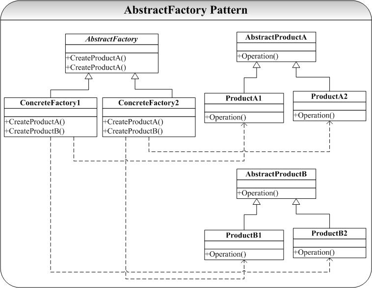

# 设计模式

## 单例模式（Singleton）

### 要求

某一个类在内存中只能创建唯一的（也可以利用引用计数控制数目）一个对象

### 应用场景


1.单例模式替换全局变量

2.配置文件内容可以用单例对象存储

3.字典、网页库、数据库连接池、线程池、文件系统、一些硬件资源（如打印机）的实例

4.Window任务管理器就只能被打开一个

### 实现方法

1.将构造函数私有化（不允许在栈上构造对象）

2.定义一个静态的成员函数，该成函数的返回值是相应类型的指针

3.定义一个静态的指向相应类型的指针


```c++
class singleton
{
public:
	/* 
	因为只有类的对象可以调用类的pubulic成员函数，而main函数中要靠getInstance来创建对象，所以在此只能设置成static
	*/
    static singleton *getInstance()//static 成员函数可通过类名直接调用
    {
        if(_pInstance==nullptr)
            _pInstance= new singleton();//单例对象只能申请在堆上
        return _pInstance;
    }   
    
    static void destroy()//协调，避免double free
    {   
        if(_pInstance)
        {   
            delete _pInstance;
            _pInstance=nullptr;//避免野指针
        }   
    }
    void addr()
    {   
        cout<<"addr is "<<this<<endl;
    }   
protected:
    //将构造函数设置为protected，禁止了在类外构造对象，同时又使得单例可以被继承（子类内部可调用）
    singleton()
    {
        cout<<"this is default structor"<<endl;
    }
private:
    int data;
    /*
    标志位，记录该singleton在内存中的位置。静态成员函数只能调用静态成员,静态成员只会存在一个,保存在全局/静态区
    */
    static singleton *_pInstance;
    
    //将析构函数放在private，避免delete singleton时产生double free问题 
    ~singleton()
    {
        cout<<"~singleton()"<<endl;
    }
};
singleton *singleton::_pInstance=nullptr;//静态成员变量类外初始化（lazy load）

int main()
{
    singleton *p1=singleton::getInstance();
    p1->addr();
    singleton *p2=singleton::getInstance();
    p2->addr();
    singleton::destroy();
    return 0;
}

```

## 建造者（Builder）

### 要求

将一个复杂对象的创建与它的表示（representation）分离，使得同样的创建过程可以创建不同的表示。

当所要创建的对象很复杂时，这种分离可以使得我们分阶段创建复杂对象，同时在每个阶段引入参数，使得相同步骤创建出的对象的表示不同。

### 应用场景

1.当创建复杂对象的算法应与被创建对象的组成部分以及它们的装配方式解耦时。
2.当构造过程必须允许被构造的对象有不同的表示时。

### 实现方法

1.一个抽象Builder类，为创建对象的每个构件定义一个默认构造方法。

2.一个继承Builder的ConcreteBuilder类，用来重写Builder的方法。

3.一个使用Builder接口的对象Director（与Builder可以是组合也可以是聚合关系）

4.Product，表示被构造的复杂对象，ConcreteBuilder决定其内部表示和装配过程。

5.Director，用来根据用户的需求选择构建的对象。

Director对象并不直接返回对象，而是通过一步步调用Builder中分步build的方法来进行对象的创建。（Builder强调一步步创建对象，并通过相同的创建过程可以获得不同的结果对象，且对象并不直接被返回）


```c++
class Product
{
public:
	Product();
	~Product();

    void add(string part){_parts.push_back(part)};
    void Show(){//展示所有部件};
private:
    List<string> _parts;
};

class Builder
{
public:
	Builder(){};
    virtual ~Builder(){};
    
    //纯虚函数，只作为接口。
    virtual void buildPartA(string param)=0; 
    virtual void buildPartB(string param)=0;
    virtual void buildPartC(string param)=0;
    virtual Product* getProduct()=0;

};

//ConcreteBuilder是可以自定义的，只要Builder的build方法满足所需构造的Product的部件
class ConcreteBuilder:public Builder
{
public:
	ConcreteBuilder(Product* product):_product(product){};;
    ~ConcreteBuilder(){};
    
    void buildPartA(string param){product->add(param)}; 
    void buildPartB(string param){product->add(param)};
    void buildPartC(string param){product->add(param)};
    
    Product* getProduct(){
        return _product;
    };
private:
    Product* _product;
}

class Director
{
public:
	Director(Builder* bld):_bld(bld){};//动态绑定ConcreteBuilder
	~Director(){};
      
    Product* ConstructABC(){
        _bld->buildPartA(user_definedA);
        _bld->buildPartB(user_definedB);
        _bld->buildPartC(user_definedC);
        return _bld->getProduct()
    };
private:
	Builder* _bld; //聚合Builder
};

int main(){
    //具体构造过程对客户端透明了
    Director* d = new Director(new ConcreteBuilder(new Product()));
    Product* p=d->constructABC();
    return 0;
}
```

## 工场模式(Factory)

### 背景

为了实现低耦合高内聚且符合里式替换原则和依赖倒置原则的多态，我们会定义多个子类继承自抽象基类。但每次用到子类时，都需要new一个子类对象。这带来两个问题：

1.类的使用者必须知道子类名（命名问题导致有些类名可读性和易记性很差）

2.程序难以扩展和维护

3.在父类中并不知道具体要实例化哪一个具体的子类。

### 要求

1.一个类希望由它的子类来创建对象（实例化操作延迟到子类）。

2.满足开闭原则，增加新的产品种类时，不对工场和产品体系进行修改。

### 实现方法


```c++
class Product
{
public:
	virtual ~Product() = 0;
	Product(){};
};

//ConcreteProduct1、ConcreteProduct2、ConcreteProduct3......
class ConcreteProduct:public Product
{
public:
	~ConcreteProduct(){};
	ConcreteProduct(){cout<<"ConcreteProduct"<<endl;};
};

class Factory
{
public:
	virtual ~Factory() = 0;
	virtual Product* CreateProduct() = 0;
	Factory(){};
};

//ConcreteFactory1、ConcreteFactory2、ConcreteFactory3......
class ConcreteFactory:public Factory
{
public:
	~ConcreteFactory();
	ConcreteFactory(){cout<<"ConcreteFactory"<<endl;};
	Product* CreateProduct(){return new ConcreteProduct;};
};

int main()
{
	Factory* fac = new ConcreteFactory();
	Product* p = fac->CreateProduct();
	return 0;
}
```

## 抽象工场(Abstract Factory)

### 要求

提供一个创建一组相关或相互依赖的对象的接口，而无需指定它们具体的类

### 实现方法

Abstract Factory 模式关键就是将这一组（多类）对象的创建封装到一个用于创建对象的类
（ConcreteFactory）中，维护这样一个创建类总比维护 n 多相关对象的创建过程要简单的多。

AbstractFactory 模式通常都是使用 Factory 模式实现的。



## 原型模式(Prototype)

### 要求

从一个对象再创建另外一个可定制的对象，且不需要知道任何创建的细节。

### 实现方法

用原型实例指定创建对象的种类，并且通过拷贝这些原型创建新的对象


Prototype 模式提供了一个通过已存在对象进行新对象创建的接口（Clone），Clone（）
实现和具体的实现语言相关，在 C++中我们将通过拷贝构造函数实现。

```c++
class Prototype
{
public:
	virtual ~Prototype();
	virtual Prototype* Clone() const = 0;

	Prototype();

};

class ConcretePrototype:public Prototype
{
public:
	ConcretePrototype(){};
	ConcretePrototype(const ConcretePrototype& cp):val(cp.val)
    {};
    
	~ConcretePrototype();
	Prototype* Clone(){
        return new ConcretePrototype(*this)} const;//const 不允许修改对象
private:
    int val=0;
};//使用了编译器合成的copy ctor做了deep copy

int main(int argc,char* argv[]){
	Prototype* p = new ConcretePrototype();
	Prototype* p1 = p->Clone();
	return 0;
}
```

## 桥接模式(Bridge/Handle)


### 要求

将抽象部分与它的实现部分分离，使它们都可以独立地变化。这并不是说让抽象类与其派生类分离，这毫无意义。实现指的是抽象类和它的派生类用来实现自己的对象。

### 目的

桥接模式的核心意图是把这些实现独立出来，让它们各自地变化。

### 实现方法

使用组合（委托）的方式将抽象和实现彻底地解耦。

合成/聚合复用原则(CARP)，尽量使用合成/聚合而不是继承。


```C++
class AbstractionImp;
class Abstraction
{
public:
	virtual ~Abstraction(){};
	virtual void Operation() = 0;
	Abstraction(){};
};

class RefinedAbstraction:public Abstraction
{
public:
	RefinedAbstraction(AbstractionImp* imp)：_imp(imp){};
	~RefinedAbstraction();
	void Operation(){_imp->Operation()};
private:
AbstractionImp* _imp;//CARP
};

class AbstractionImp
{
public:
    AbstractionImp(){};
	virtual ~AbstractionImp(){};
	virtual void Operation() = 0;
};

class ConcreteAbstractionImpA:public AbstractionImp
{
public:
	ConcreteAbstractionImpA(){};
	~ConcreteAbstractionImpA(){};
	virtual void Operation(){cout<<"ConcreteAbstractionImpA...."<<endl;};
};

class ConcreteAbstractionImpB:public AbstractionImp
{
public:
	ConcreteAbstractionImpB(){};
	~ConcreteAbstractionImpB(){};
	virtual void Operation(){cout<<"ConcreteAbstractionImpB...."<<endl;};
};

int main(int argc,char* argv[])
{
	AbstractionImp* imp = new ConcreteAbstractionImpA();
	Abstraction* abs = new RefinedAbstraction(imp);
	abs->Operation();
	return 0;
}
```

## 适配器/包装器（Adapter/Wrapper）

### 要求

通过将一个类的接口转换成客户希望的另外一个接口，使得原本由于接口不兼容而不能一起工作的那些类可以一起工作。

### 目的

使得那些仅仅是接口不匹配而功能正确的为复用而设计的类可以被正常使用。

### 应用场景

系统的数据和行为都正确，但接口不符时，我们应该考虑使用适配器模式，使得控制范围之外的一个原有对象与某个接口匹配。

适配器模式主要应用于希望复用一些现存的类，但接口又与服用环境要求不一致的情况。

### 实现方法


```C++
//类模式的Adapter采用继承的方式复用Adaptee的接口。
class Target //适配目标
{
public:
	Target(){};
	virtual ~Target(){};
	virtual void Request(){cout<<"Target::Request"<<endl;};
};

class Adaptee //适配者
{
public:
	Adaptee(){};
	~Adaptee(){};
	void SpecificRequest(){cout<<"Adaptee::SpecificRequest"<<endl;};
};

/*
在类模式Adapter中，我们通过private继承Adaptee获得实现继承的效果，而通过public继承Target获得接口继承的效果
*/
class Adapter:public Target,private Adaptee
{
public:
	Adapter(a,b,c,d,e):_Target(Target(a,b)),_c(c),_d(d),_e(e);
	~Adapter();
	void Request(){this->SpecificRequest()};
private:
	int _c=0;
    int _d=0;
    int _e=0;
};

//客户端通过适配器来使用适配目标
int main()
{
	//Adaptee* ade = new Adaptee;
	Target* adt = new Adapter;
	adt->Request();//通过适配器调用到了适配目标的SpecificRequest()
	return 0;
}

```


```c++
//对象模式的 Adapter 中采用组合的方式实现 Adaptee 的复用。
class Target
{
public:
	Target(){};
	virtual ~Target(){};
	virtual void Request(){cout<<"Target::Request"<<endl;};
};

class Adaptee
{
public:
	Adaptee(){};
	~Adaptee(){};
	void SpecificRequest()_{cout<<"Adaptee::SpecificRequest"<<endl;};
};

class Adapter:public Target
{
public:
	Adapter(Adaptee* ade):_ade(ade){};
	~Adapter(){};
	void Request(){_ade->SpecificRequest();};
private:
	Adaptee* _ade;
};

int main()
{
	Adaptee* ade = new Adaptee;
	Target* adt = new Adapter(ade);
	adt->Request();
	return 0;
}
```

## 组合（Composite）

### 目的

将对象组合成树形结构以表示“部分 -整体”的层次结构。使得用户对单个对象和组合对象的使用具有一致性。

### 应用场景

需要递归构建树状的对象结构时。

### 实现方法

### 

```c++
class Component
{
public:
	Component();
	virtual ~Component();

	virtual void Operation() = 0;
	virtual void Add(const Component& );
	virtual
	void Remove(constComponent& );
	virtual Component* GetChild(int );
};


```

